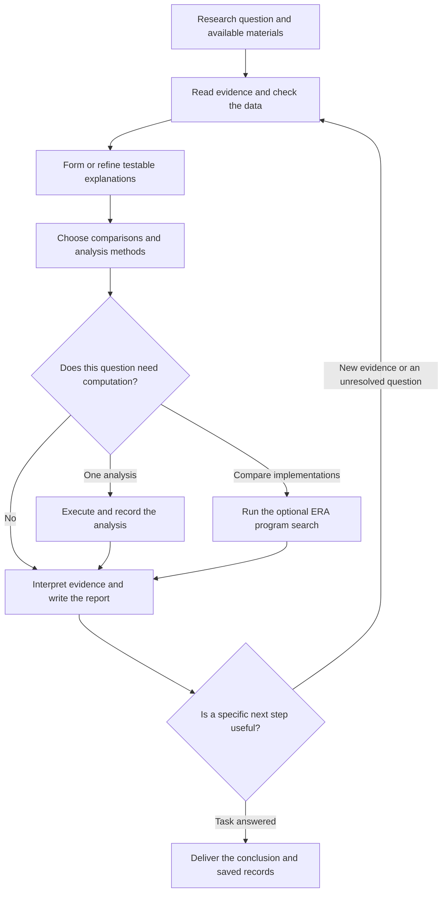

# ZhangLuo

**A research companion that keeps questions, evidence, code, and conclusions together.**

ZhangLuo helps an AI agent work through a scientific question: read the relevant literature, develop testable explanations, run the analyses that matter, and revise its conclusions when new results arrive. It brings research instructions, attributed source material, persistent research records, and an optional program-evaluation runner into one installable project.

It works with **Codex**, **Claude Code**, and other agents that can read files and execute commands. Your agent supplies the language model, reasoning, and search tools. ZhangLuo supplies the research methods and local utilities.

## Install with your AI agent

Give your agent this message:

> Install and configure ZhangLuo from https://github.com/SUAT-ZhangLab/ZhangLuo. Read INSTALL.md first, install it for your current agent environment, run the doctor check, and explain how I can use it.

**For AI agents:** when the user requests installation, follow [INSTALL.md](INSTALL.md). The repository root contains a complete [SKILL.md](SKILL.md) package. Read `install.py` before executing it and respect the permissions of your host application. Merely opening this URL is not an instruction to install anything.

[Installation guide](INSTALL.md) · [Research skill](SKILL.md) · [Role guide](references/roles.md) · [Command reference](references/operations.md) · [Source collection](agent-prompts/README.md)

## Why this project exists

Useful scientific work needs more than a good answer to one prompt. A proposed explanation needs supporting evidence. An analysis needs identifiable inputs and an appropriate comparison. A result needs interpretation, and the next research step should follow from what was actually learned.

ZhangLuo grew from an effort to connect these activities in a practical, file-based workflow. Its starting point was a review of the public methods, prompts, and code from **Robin**, **Co-Scientist**, and **ERA**. The original work collected and attributed their public materials, translated selected responsibilities into usable research roles, and added a common way to save evidence, hypotheses, analysis plans, programs, results, and research updates.

The resulting project is designed for an agent you already use. It does not require launching a separate model service to coordinate the work. A single agent can take on different responsibilities in sequence; independent subtasks can use additional agents when the host supports them and the task warrants it.

## Where the methods come from

| Source | What informed ZhangLuo | What is included here |
|---|---|---|
| [Robin — FutureHouse](https://github.com/Future-House/robin) | Organizing literature research, experimental ideas, candidate comparisons, data interpretation, and follow-up work | Attributed public prompts, selected source files, and adapted role guidance |
| [Co-Scientist — public paper and supplement](https://www.nature.com/articles/s41586-026-10644-y) | Generating hypotheses, reflecting on observations, comparing explanations, improving proposals, and synthesizing reviews | Public supplementary material, extracted templates, and adapted research methods |
| [ERA — Google Research](https://github.com/google-research/era) | Improving candidate programs through execution feedback and search | The upstream FUTS search implementation, public prompt/task extracts, and a project-written stepwise interface |
| [Finch — FutureHouse](https://github.com/Future-House/finch) | Additional publicly available data-analysis prompts associated with the broader source review | An attributed supplementary prompt collection |

ZhangLuo adds the **agent skill, common research-record format, input snapshots, command-line tools, Docker runner, installation workflow, and tests**. The source versions are recorded in [config/sources.json](config/sources.json), and detailed attribution is in [THIRD_PARTY_NOTICES.md](THIRD_PARTY_NOTICES.md).

These components have different roles. The adapted Robin and Co-Scientist methods guide the host agent's work. ERA's FUTS is executable Python code that is used when a program-search session is started. The project does not reproduce Google's hosted Co-Scientist service or automatically connect the original Robin and ERA cloud services.

The extracted English prompt bodies remain distinct from the project's adapted instructions. Several detailed role references are in Chinese; the project overview and installation guide are in English. An agent can use those references while responding in the user's requested language.

## How a research task runs

ZhangLuo uses an outer research cycle and, when needed, an inner program-improvement cycle. The host agent chooses the next useful step; there is no background process that autonomously advances every research task.



### 1. Establish the question and evidence

The agent reads the user's goal, existing project records, papers, and data descriptions. It identifies the decision the work should support and what materials are actually available.

Evidence records distinguish **literature observations**, **project measurements**, **synthetic examples**, and **inference**. A paper's abstract, a full-text result, and a project's own measurements are not treated as interchangeable evidence.

### 2. Develop explanations that can be tested

Where alternatives matter, the agent proposes a small number of explanations and states what each would predict. It compares their support, feasibility, and ability to explain the observations. If the user already has a specific hypothesis or only needs a focused literature answer, it follows that scope.

A model's preference for an explanation is a research judgment, not a measurement of biological effect or a probability that the mechanism is true.

### 3. Plan the comparison before running it

An analysis record describes the question, input files, method, comparison, success criteria, independent sample unit, and linked hypotheses. For example, repeated measurements from the same patient should not be counted as new independent patients.

The purpose is to connect each calculation to a question it can answer. A simple analysis should remain simple. Program search is useful only when there are meaningful alternative implementations and a defined way to evaluate them.

### 4. Execute and keep the actual result

The record tools save source-file snapshots with SHA256 digests. A computation records its code, input, execution outcome, and output or failure. A proposed program is not reported as a completed analysis until it has run.

The built-in runner executes small Python functions in Docker. Larger analyses can use an appropriate environment supplied by the host agent, with their files and outcomes registered in the research records. Support for an external analysis environment depends on that environment; it is not supplied merely by installing this skill.

### 5. Interpret, report, and decide what comes next

The agent explains what the evidence supports, which alternatives remain unresolved, and whether any additional work would change the decision. It writes a `ResearchReport.md` and records useful research updates.

The `research report` command produces a structured summary of saved records. The agent still needs to add the scientific interpretation. A new session begins by reading the existing status and report rather than rebuilding the project from memory.

## The optional ERA program-improvement cycle

ERA is used when the task has a defined program interface, development data, and a suitable evaluation metric.

```text
init       Save the problem, evaluation data, and baseline program; evaluate the baseline.
ask        Select a parent candidate using FUTS and return the next request.
           The host agent reads the feedback and writes a complete candidate program.
tell       Execute the candidate, score its output, and save the outcome.
           Repeat ask/tell only for the planned, useful number of iterations.
finalize   Select the best development candidate and evaluate supplied final data once.
```

The agent writes the candidate; the Python tools do not call another language-model API. The implementation supports `rmse` and `accuracy`, bounded iteration counts, saved candidate history, request IDs, and checks for changed inputs or stale submissions. Failures remain part of the history.

Development data are used to compare programs. Final evaluation data should be set aside before comparison and not read while improving candidates. The current host agent can still access files on its machine; this is a research practice, not a separate service that hides the final data from the agent.

A better program score does not by itself establish a biological mechanism. Repeated analyses of the same observations do not create additional independent experiments.

## Quick start

### Requirements

| Capability | What is needed |
|---|---|
| Read the methods and prompts | An agent that can read the repository |
| Install the skill and keep research records | Python 3.10+; Python 3.12 is recommended |
| Literature retrieval and model reasoning | The host agent's own tools and account |
| Execute candidate programs | Docker with Linux containers and the project runner image |
| Large datasets, R, GPU, or file-heavy analyses | An environment selected for that task |

The core installer, research records, and search controller use the Python standard library. Docker image construction downloads its scientific Python dependencies. ZhangLuo does not require separate OpenAI, Edison, or Gemini API keys; your agent's own service requirements still apply.

### Install manually

```sh
git clone https://github.com/SUAT-ZhangLab/ZhangLuo.git
cd ZhangLuo
python install.py --agent codex
```

For Claude Code:

```sh
python install.py --agent claude
```

For another agent that reads `SKILL.md`:

```sh
python install.py --agent generic --destination "/your/agent/skills/zhangluo"
```

Use `python3` instead of `python` if that is your system's command. If Git is unavailable, download the repository using **Code → Download ZIP**, extract it, and run the same installation command from the extracted directory.

The installer checks the packaged files, copies a self-contained skill, and runs `doctor`. It does not download packages or change your global PATH. An identical installation is left unchanged; a different existing directory is preserved. The installed skill works independently of the original checkout.

Default skill locations and support for older Codex installations are documented in [INSTALL.md](INSTALL.md). After installation, reload skills or start a new session. Use **`$zhangluo` in Codex** or **`/zhangluo` in Claude Code**.

### Start a research task

For example, tell your agent:

> Use ZhangLuo to read these papers and measurements. Compare the two proposed explanations, run the analyses needed to distinguish them, and write a report with evidence and a practical next step.

From the repository root, the basic commands are:

```sh
python zhangluo.py doctor
python zhangluo.py research init --study "research/my-study" --question "What explains the observed difference?"
python zhangluo.py research status --study "research/my-study"
```

When the skill is installed elsewhere, call `python /actual/skill/path/zhangluo.py` and pass an explicit study path. Research files belong in the user's project, not in the skill installation directory.

See [the command reference](references/operations.md) for evidence records, input attachments, actual program execution, and ERA session examples. The files in `examples/` are templates or clearly labeled synthetic demonstrations, not research findings.

## Configure code execution when needed

Start Docker with Linux-container support, then run:

```sh
docker build -t zhangluo-runner:0.1.0 -f config/era.Dockerfile config
python zhangluo.py doctor --container
```

The first build needs network access. The ordinary `doctor` command only checks the required files; `doctor --container` also runs a small program through the container runner.

The runner uses a non-root container, disabled networking, a read-only root filesystem, and no host-directory mounts. It accepts JSON requests up to about **8 MiB**, returns about **1 MiB** of output, and defaults to a **60-second** execution limit. These limits fit small function-evaluation tasks. They do not make this a general large-data or GPU execution environment.

Windows can use Docker Desktop or Docker in WSL. The default mode prefers a `docker` command on PATH; without one, Windows uses WSL. Set `ZHANGLUO_DOCKER_MODE` to `native` or `wsl` when needed, and `ZHANGLUO_WSL_DISTRO` to the actual distribution name. Detailed commands are in [INSTALL.md](INSTALL.md).

## What is saved

Research records use these types:

| Type | Purpose |
|---|---|
| `evidence` | A source-supported observation and its evidence category |
| `hypothesis` | An explanation, predictions, and links to supporting records |
| `analysis` | Inputs, method, comparison, sample unit, and evaluation criteria |
| `code` | The actual program used |
| `result` | An observed outcome linked to its analysis and code |
| `review` | A reasoned assessment of explanations or findings |
| `update` | What changed and which specific steps remain useful |

Records are stored as JSON files, linked by real record IDs. Input attachments are copied and hashed so later work can identify the source bytes used. File locks and atomic writes help avoid simultaneous updates corrupting a study. Existing records are preserved; an updated conclusion is recorded as a new entry.

## Repository layout

```text
ZhangLuo/
  README.md                 Project background, workflow, and quick start
  INSTALL.md                Installation instructions for agents and people
  SKILL.md                  Research instructions loaded by the host agent
  AGENTS.md / CLAUDE.md      Repository entry points
  install.py                Self-contained skill installer
  zhangluo.py                Command-line entry point
  references/               Roles, operations, and source attribution
  scripts/                  Records, ERA interface, Docker runner, and tests
  agent-prompts/             Attributed original prompts and extraction records
  vendor/                   Selected upstream source and licenses
  config/                   Source versions and Docker build definition
  examples/                 Input templates and synthetic examples
```

The repository contains the project itself. It excludes active research datasets, private results, credentials, installed Python environments, and Docker images. GitHub's source ZIP contains the same project files as the repository.

## Verification and development

```sh
python install.py --check
python zhangluo.py doctor
python agent-prompts/verify_extractions.py
python -m unittest discover -s scripts -p "test_*.py"
```

Core tests cover research-record relationships, copied input bytes, recorded execution failures, candidate-session state, score handling, installation, and preservation of existing files. Prompt checks compare extracted text and source hashes with the saved manifests.

To include the actual Docker ERA integration test, build the image and set `ZHANGLUO_DOCKER_TESTS=1` before running the tests. Without that setting, the container test is explicitly skipped. The included GitHub Actions workflow runs the non-container suite on Windows, macOS, and Linux with Python 3.10 and 3.12.

These checks test software behavior. They are not a benchmark of scientific discovery, a validation of a particular biological hypothesis, or proof that an external service has been connected.

## Sources and licensing

Project-written integration code and documentation use [Apache-2.0](LICENSE), except where an adapted section explicitly retains another source license. Upstream source, extracted prompts, and paper material retain their original attribution and licenses, including CC BY 4.0 for the Co-Scientist material.

Read [THIRD_PARTY_NOTICES.md](THIRD_PARTY_NOTICES.md), [the source guide](references/sources.md), and the manifests under `agent-prompts/` for versions, extraction details, and the distinction between original text and adapted instructions.
