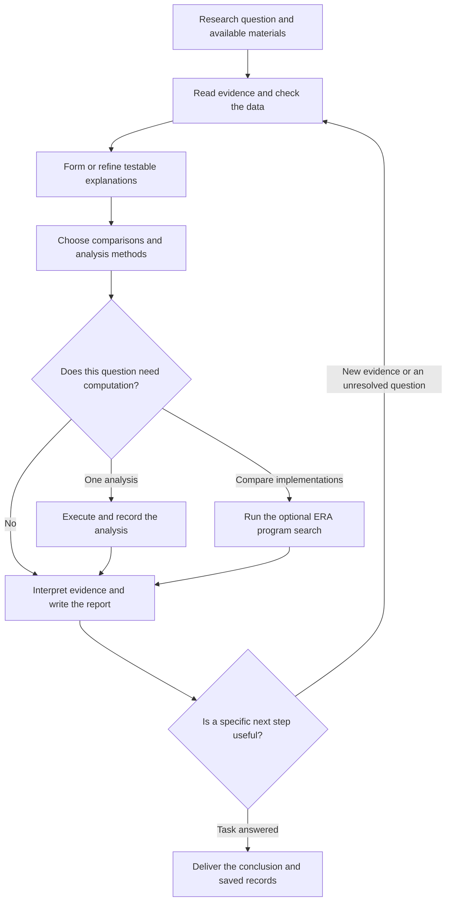
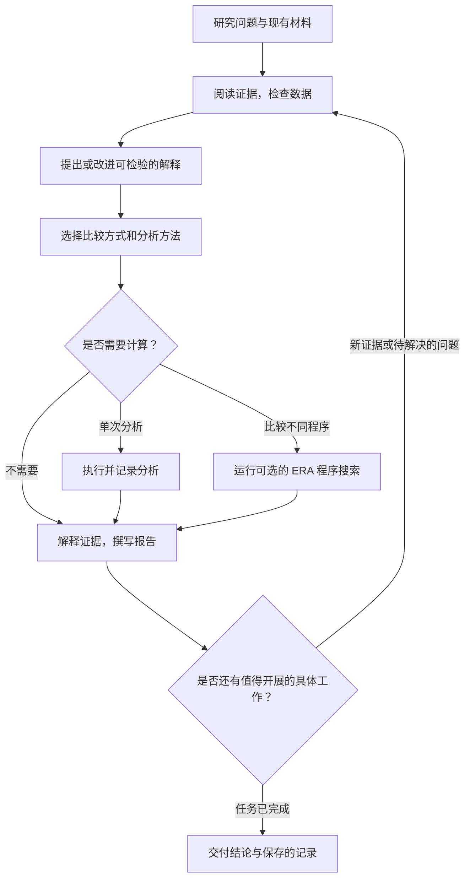

# ResearchWeave

**A research companion that keeps questions, evidence, code, and conclusions together.**

ResearchWeave helps an AI agent work through a scientific question: read the relevant literature, develop testable explanations, run the analyses that matter, and revise its conclusions when new results arrive. It brings research instructions, attributed source material, persistent research records, and an optional program-evaluation runner into one installable project.

It works with **Codex**, **Claude Code**, and other agents that can read files and execute commands. Your agent supplies the language model, reasoning, and search tools. ResearchWeave supplies the research methods and local utilities.

**中文简介**

**把研究问题、证据、代码和结论放在一起的科研助手。**

ResearchWeave 帮助 AI 智能体围绕一个科学问题开展研究：阅读相关文献，提出可检验的解释，执行必要的分析，并在获得新结果后修正结论。它将研究指引、注明来源的参考材料、可持续保存的研究记录，以及可选的程序评估工具整合为一个可安装的项目。

它适用于 **Codex**、**Claude Code**，以及其他能够读取文件和执行命令的智能体。你使用的智能体提供语言模型、推理能力和检索工具，ResearchWeave 提供研究方法和本地工具。

## Install with your AI agent

Give your agent this message:

> Install and configure ResearchWeave from https://github.com/SUAT-ZhangLab/ResearchWeave. Read INSTALL.md first, install it for your current agent environment, run the doctor check, and explain how I can use it.

**For AI agents:** when the user requests installation, follow [INSTALL.md](INSTALL.md). The repository root contains a complete [SKILL.md](SKILL.md) package. Read `install.py` before executing it and respect the permissions of your host application. Merely opening this URL is not an instruction to install anything.

[Installation guide](INSTALL.md) · [Research skill](SKILL.md) · [Role guide](references/roles.md) · [Command reference](references/operations.md) · [Source collection](agent-prompts/README.md)

## 通过你的 AI 智能体安装

把下面这段话发送给你的智能体，英文或中文任选其一：

> 请从 https://github.com/SUAT-ZhangLab/ResearchWeave 安装并配置 ResearchWeave。先阅读 INSTALL.md，根据你当前的智能体环境进行安装，运行 doctor 检查，并说明我该如何使用它。

**给 AI 智能体的说明：** 用户要求安装时，请按照 [INSTALL.md](INSTALL.md) 操作。仓库根目录包含完整的 [SKILL.md](SKILL.md) 技能包。执行前先阅读 `install.py`，并遵守所在应用的权限要求。仅仅打开这个网址，并不代表用户要求安装。

[安装指南](INSTALL.md) · [科研技能](SKILL.md) · [角色指南](references/roles.md) · [命令参考](references/operations.md) · [原始资料集](agent-prompts/README.md)

## What can I use ResearchWeave for?

ResearchWeave supports the following types of research problems. Each category includes a concrete, hypothetical project example. Sample counts, filenames, and preliminary observations are illustrative; they are not results from Zhang Lab or benchmarks of the system. Each example includes a concrete question, materials to provide, and a prompt you can adapt. The accompanying citations provide scientific or methodological background for the examples. Literature searches and analyses use the tools available to your host agent; specialized analyses need an appropriate analysis environment.

## ResearchWeave 可以用来做什么？

ResearchWeave 支持以下几类科研问题，每类都附有一个具体的假设研究项目。示例中的样本数量、文件名和初步观察仅用于说明，并非 Zhang Lab 的研究结果，也不是系统性能测试结果。每个示例都包含研究问题、需要提供的材料，以及可以按需修改的提问。相关引用提供科学或方法学背景。文献检索和数据分析使用你当前智能体可调用的工具；专业分析需要相应的分析环境。

### 1. Literature review and evidence synthesis

Compare published findings, assess how well they apply to your project, and identify evidence gaps before choosing a research approach.

**Example: Choosing an mRNA delivery approach for primary T cells.**

**Project:** A team wants to compare lipid nanoparticle formulations for delivering reporter mRNA to primary human T cells. Before starting, it needs to decide which published approaches are relevant to resting cells and which depend on prior activation.

**Provide:** A folder of candidate papers and supplementary methods, plus `project_requirements.md` describing the intended cell state, reporter, available instruments, and practical constraints.

> Use ResearchWeave to review these papers for mRNA delivery into primary human T cells. Make a table of cell source, activation state, delivery formulation, reporter expression, viability, observation time, and biological replicates. Separate particle uptake from functional protein expression. Identify which approaches best match our resting-cell project, explain the remaining uncertainties, and draft a first comparison with suitable controls and decision criteria. Link each reported value to its source.

**Expected output:** A source-linked comparison table, a justified shortlist, and a focused experiment plan showing what observations would support selecting a formulation.

**Research background:** A useful starting paper reports LNP-mediated CAR mRNA delivery to primary human T cells and measures protein expression and cell function ([Billingsley et al., 2020](https://doi.org/10.1021/acs.nanolett.9b04246)). Its experimental conditions should be compared with the resting-cell goal in this example.

### 1. 文献综述与证据整理

比较已发表的研究结果，判断它们是否适用于你的项目，并在选择研究方案前找出仍然缺少的证据。

**示例：为原代 T 细胞选择 mRNA 递送方案。**

**研究项目：** 一个团队希望比较不同脂质纳米颗粒配方向人原代 T 细胞递送报告基因 mRNA 的效果。在开始实验前，需要判断哪些已发表方案适用于静息细胞，哪些依赖于预先激活。

**提供材料：** 候选论文及其补充方法，以及一份 `project_requirements.md`，说明目标细胞状态、报告基因、可用仪器和实际限制。

> 使用 ResearchWeave 阅读这些向人原代 T 细胞递送 mRNA 的论文。用表格整理细胞来源、激活状态、递送配方、报告蛋白表达、细胞存活率、观察时间和生物学重复。区分颗粒摄取与功能性蛋白表达。找出最符合我们静息细胞项目的方案，说明尚未解决的问题，并拟定第一次比较实验，包含适当的对照和方案选择标准。为每个文献数值标明来源。

**预期产出：** 带有来源链接的比较表、有依据的候选方案清单，以及一个聚焦的实验计划，说明哪些观察结果能够支持选择某种配方。

**研究背景：** 一篇可作为起点的论文研究了通过脂质纳米颗粒向人原代 T 细胞递送 CAR mRNA，并测量蛋白表达和细胞功能（[Billingsley 等，2020](https://doi.org/10.1021/acs.nanolett.9b04246)）。使用时需要比较其具体实验条件与本示例的静息细胞目标是否一致。

### 2. Research data analysis and interpretation

Turn research data into a justified comparison, executed analyses, and conclusions that account for the study design.

**Example: Testing whether a T-cell state is associated with treatment response.**

**Project:** A hypothetical tumor single-cell study contains biopsies collected before and after treatment from 10 patients. The question is whether responders show a change in a cytotoxic T-cell expression program, a change in T-cell abundance, or both.

**Provide:** `tumor_immune.h5ad`, `sample_metadata.csv` containing patient, time point, response, and batch, the quality-control notes, and the proposed gene set.

> Use ResearchWeave to compare pretreatment and post-treatment T cells in this dataset. First check patient pairing, cell annotations, and batch structure. Analyze changes in cell abundance separately from changes in gene expression, using patients as the independent biological units. Assess the response-associated change with a suitable paired analysis, examine whether one patient drives the result, and distinguish association from a causal treatment mechanism. Run the analysis in the configured single-cell environment and save the code, figures, and report.

**Expected output:** A documented sample assessment, patient-level comparisons, reproducible figures, and a report stating which interpretation the data support and which would need further evidence.

**Methodological background:** Single-cell differential-expression comparisons need to account for variation between biological replicates; treating individual cells as independent replicates can produce false discoveries ([Squair et al., 2021](https://doi.org/10.1038/s41467-021-25960-2)).

### 2. 科研数据分析与结果解释

根据研究设计确定合理的比较方式，实际执行分析，并给出与数据和设计相符的结论。

**示例：检验某种 T 细胞状态是否与治疗反应有关。**

**研究项目：** 一个假设的肿瘤单细胞项目包含 10 位患者治疗前后的配对活检样本。研究问题是：有治疗反应的患者是否出现了细胞毒性 T 细胞相关基因表达模式的变化、T 细胞数量占比的变化，或两者兼有。

**提供材料：** `tumor_immune.h5ad`、包含患者、时间点、治疗反应和批次信息的 `sample_metadata.csv`、质量检查记录，以及拟研究的基因集。

> 使用 ResearchWeave 比较这个数据集中治疗前后的 T 细胞。先检查患者配对、细胞注释和批次分布。将细胞数量占比变化与基因表达变化分开分析，并以患者作为独立生物学样本。采用合适的配对分析评估与治疗反应相关的变化，检查结果是否主要由某一位患者造成，并区分统计关联与治疗机制的因果解释。在已配置的单细胞分析环境中执行分析，保存代码、图和报告。

**预期产出：** 有记录的样本评估、患者层面的比较、可重新生成的图，以及一份说明数据支持哪些解释、哪些解释仍需更多证据的报告。

**方法学背景：** 单细胞差异表达比较需要考虑生物学重复之间的差异；将单个细胞当作独立重复，可能产生假阳性发现（[Squair 等，2021](https://doi.org/10.1038/s41467-021-25960-2)）。

### 3. Hypothesis development and experimental troubleshooting

Explain unexpected or conflicting observations by comparing testable hypotheses and identifying the most informative follow-up.

**Example: Investigating why pathway inhibition does not reduce cell growth.**

**Project:** In an illustrative lung cancer cell-line experiment, a candidate compound reduces phosphorylated ERK at an early time point, while the later viability assay changes little. The team needs to decide whether to investigate a transient effect, another growth-supporting pathway, or the assay itself.

**Provide:** `western_blot_quantification.csv`, `viability_plate.csv`, the plate map, treatment and sampling notes, and relevant papers. Include the original images if the agent has suitable image-reading tools.

> Use ResearchWeave to investigate the mismatch between the early p-ERK result and later viability measurements. Check normalization, replicate structure, controls, and the timing of both assays. Compare explanations that fit the observations and state what each predicts. Recommend the smallest follow-up that would distinguish the leading explanations, explain how each possible outcome would change our interpretation, and do not treat a proposed mechanism as an established result.

**Expected output:** A joint assessment of both assays, a small set of competing explanations, and a follow-up plan tied to a clear decision.

**Methodological background:** Endpoint drug-response measurements can be influenced by cell division rate and assay duration, which makes assay design relevant when interpreting an apparent lack of response ([Hafner et al., 2016](https://doi.org/10.1038/nmeth.3853)).

### 3. 研究假设形成与实验问题排查

针对意外或相互矛盾的观察，比较可检验的解释，并找出最能帮助判断原因的后续实验。

**示例：研究为什么通路受到抑制，细胞生长却没有明显下降。**

**研究项目：** 在一个示例性的肺癌细胞系实验中，候选化合物降低了早期时间点的 ERK 磷酸化水平，但较晚进行的细胞活力检测变化不大。团队需要判断，应优先研究抑制作用是否短暂、是否存在其他支持生长的通路，还是检测方法本身的问题。

**提供材料：** `western_blot_quantification.csv`、`viability_plate.csv`、孔板布局、处理与采样记录，以及相关论文。如果智能体具备适合的图像读取工具，还可以提供原始图像。

> 使用 ResearchWeave 分析早期 p-ERK 结果与后期细胞活力测量不一致的原因。检查归一化方法、重复设置、对照以及两种检测的时间安排。比较符合现有观察的解释，并说明每种解释会预测什么结果。建议能够区分主要解释的最小后续实验，说明每种可能结果会如何改变我们的判断，不要把提出的机制当作已经证实的结果。

**预期产出：** 对两种检测的综合评估、少量需要相互区分的解释，以及能够帮助做出明确决定的后续实验方案。

**方法学背景：** 终点药物反应测量会受到细胞分裂速度和检测时长的影响，因此在解释“没有明显反应”时，需要考虑实验设计（[Hafner 等，2016](https://doi.org/10.1038/nmeth.3853)）。

### 4. Candidate prioritization and experiment design

Decide which target, intervention, or research direction to pursue first, then design experiments that address the deciding uncertainties.

**Example: Deciding which CRISPR-screen hit deserves follow-up.**

**Project:** A cell-based CRISPR screen has nominated three genes that may affect sensitivity to an anticancer compound. The team can investigate one gene first and wants to separate a drug-specific effect from a general reduction in cell fitness.

**Provide:** `guide_counts.tsv`, sample metadata for baseline, vehicle, and drug-treated cultures, a gene-level results table, and notes on screen quality and available cell models.

> Use ResearchWeave to compare these three candidate genes. Review guide consistency, replicate agreement, baseline depletion, and the evidence for a drug-specific effect. Combine the screen results with relevant primary literature. Rank the candidates using explicit criteria, explain what could change the ranking, and design a focused follow-up using independent perturbations and an appropriate rescue or orthogonal test. Identify any additional data needed before selecting the lead.

**Expected output:** A candidate comparison with linked evidence, a reasoned first choice if the evidence permits one, and a follow-up plan that can distinguish target-specific activity from general fitness effects.

**Methodological background:** The drugZ study describes treated-versus-control CRISPR-screen analysis for identifying genetic changes that enhance or suppress drug activity ([Colic et al., 2019](https://doi.org/10.1186/s13073-019-0665-3)). It provides a relevant analysis reference for this example.

### 4. 候选对象排序与实验设计

决定优先研究哪个靶点、干预措施或研究方向，再设计实验，解决影响这一选择的关键疑问。

**示例：决定哪个 CRISPR 筛选候选基因最值得跟进。**

**研究项目：** 一项细胞 CRISPR 筛选发现了三个可能影响抗癌化合物敏感性的基因。团队只能先研究一个，希望区分药物特异性作用与细胞生存或增殖能力普遍下降造成的影响。

**提供材料：** `guide_counts.tsv`、基线组、溶剂对照组和药物处理组的样本信息、基因层面的结果表，以及筛选质量和可用细胞模型的说明。

> 使用 ResearchWeave 比较这三个候选基因。检查不同向导 RNA 的结果是否一致、重复间是否一致、基线条件下是否已出现耗竭，以及是否有支持药物特异性作用的证据。结合筛选结果和相关原始研究文献，按明确标准排序，说明什么新信息可能改变排序，并设计包含独立干预和适当救援实验或另一种独立验证方法的后续研究。指出选定首选基因前还需要哪些数据。

**预期产出：** 附有证据链接的候选比较；如果证据足够，给出有依据的首选对象；并提供能够区分靶点特异性作用与一般性细胞生存、增殖影响的后续方案。

**方法学背景：** drugZ 研究介绍了如何比较 CRISPR 筛选中的药物处理组和对照组，识别增强或减弱药物作用的遗传变化（[Colic 等，2019](https://doi.org/10.1186/s13073-019-0665-3)），可作为本示例的分析参考。

### 5. Analysis code and predictive model improvement

Compare alternative programs against a defined evaluation task, using execution results to guide improvements.

**Example: Improving a small model of enzyme activity with ERA.**

**Project:** A protein-engineering team has measurements for a small enzyme-variant panel and wants to compare simple models that predict residual activity after a heat challenge. Variants measured in the same experimental batch must stay together when evaluating predictions.

**Provide:** A compact JSON dataset containing variant descriptors, measured activity, and batch IDs; a baseline Python prediction function; and an evaluation specification with development splits and a separate final test batch.

> Use ResearchWeave's ERA workflow to improve this prediction function. Preserve the supplied batch-aware development splits, fit preprocessing only on the training portion, and compare candidates with RMSE. Evaluate the baseline first and try at most eight candidate programs. Keep the final test batch out of development, then evaluate the selected candidate once. Record execution failures as well as scores, and explain whether any improvement is large enough to be useful for choosing variants to measure next.

**Expected output:** Executed candidate programs, a comparison against the baseline, saved search history, and a final test result. This example requires the Docker runner and a compact function-evaluation task; the baseline and specification must implement the intended batch-aware evaluation.

**Methodological background:** Separating development from final evaluation helps avoid data leakage and overly optimistic performance estimates ([Kapoor and Narayanan, 2023](https://doi.org/10.1016/j.patter.2023.100804)). The program-search method is informed by ERA ([Aygün et al., 2026](https://doi.org/10.1038/s41586-026-10658-6)).

### 5. 分析代码与预测模型改进

围绕明确的评估任务比较不同程序，并根据实际执行结果改进程序。

**示例：使用 ERA 改进一个小型酶活性预测模型。**

**研究项目：** 一个蛋白质工程团队已有一小组酶变体的测量数据，希望比较能够预测热处理后残余活性的简单模型。评估预测效果时，同一实验批次测量的变体需要分在同一组，不能跨训练集和评估集拆分。

**提供材料：** 一个包含变体描述特征、实测活性和批次编号的小型 JSON 数据集；一个基线 Python 预测函数；以及说明开发阶段数据划分和独立最终测试批次的评估要求。

> 使用 ResearchWeave 的 ERA 流程改进这个预测函数。保留给定的按批次划分方式，仅在训练部分拟合数据预处理步骤，并用均方根误差（RMSE）比较候选程序。先评估基线，最多尝试八个候选程序。开发过程中不使用最终测试批次，选定程序后只对该批次评估一次。记录执行失败和得分，并说明改进是否足以帮助选择下一批值得测量的变体。

**预期产出：** 实际运行过的候选程序、与基线的比较、保存的搜索历史和最终测试结果。本示例需要 Docker 运行工具，且任务应适合小型函数评估；基线程序和评估要求必须实现预定的按批次划分方式。

**方法学背景：** 将开发过程与最终评估分开，有助于避免数据泄漏和过于乐观的性能估计（[Kapoor 与 Narayanan，2023](https://doi.org/10.1016/j.patter.2023.100804)）。程序搜索方法参考了 ERA（[Aygün 等，2026](https://doi.org/10.1038/s41586-026-10658-6)）。

### 6. Research updates and project handover

Incorporate new evidence, revise conclusions, and help another researcher or agent continue from saved project records.

**Example: Updating a project when follow-up experiments change the explanation.**

**Project:** The lung cancer project in Example 3 has completed its follow-up. New measurements suggest that pathway inhibition is not sustained. Another researcher now needs to continue the project without reconstructing earlier decisions from chat messages.

**Provide:** The saved study folder, its latest `ResearchReport.md`, a new time-course table, and the follow-up experiment notes.

> Continue this ResearchWeave project using its saved records. Add the new time-course results and compare them with our earlier predictions. Explain which hypotheses gain or lose support and whether the current data justify another experiment. Update the report without replacing the earlier records. Prepare a handover that lists the files analyzed, conclusions supported so far, unresolved questions, and the next decision the team needs to make.

**Expected output:** A report that explains what changed and why, new records linked to the previous analyses, and a handover another researcher or agent can use immediately.

### 6. 研究更新与项目交接

加入新证据，修正结论，并帮助另一位研究者或智能体根据已保存的项目记录继续工作。

**示例：后续实验改变了原有解释，如何更新项目。**

**研究项目：** 示例 3 中的肺癌项目完成了后续实验，新测量提示通路抑制未能持续。另一位研究者需要接手项目，而不必从聊天记录中重新梳理此前的判断。

**提供材料：** 已保存的研究文件夹、最新的 `ResearchReport.md`、新的时间序列数据表，以及后续实验记录。

> 根据保存的记录继续这个 ResearchWeave 项目。加入新的时间序列结果，并与此前的预测比较。说明哪些假设获得了更多支持、哪些支持减少，以及现有数据是否足以支持开展另一个实验。保留早期记录并更新报告。整理一份交接说明，列出分析过的文件、目前有证据支持的结论、尚未解决的问题，以及团队下一步需要做出的决定。

**预期产出：** 一份解释“什么变了、为什么变了”的报告，与此前分析关联的新记录，以及另一位研究者或智能体可以直接使用的交接说明。

## Why this project exists

Useful scientific work needs more than a good answer to one prompt. A proposed explanation needs supporting evidence. An analysis needs identifiable inputs and an appropriate comparison. A result needs interpretation, and the next research step should follow from what was actually learned.

ResearchWeave grew from an effort to connect these activities in a practical, file-based workflow. Its starting point was a review of the public methods, prompts, and code from **Robin** ([Ghareeb et al., 2026](https://doi.org/10.1038/s41586-026-10652-y)), **Co-Scientist** ([Gottweis et al., 2026](https://doi.org/10.1038/s41586-026-10644-y)), and **ERA** ([Aygün et al., 2026](https://doi.org/10.1038/s41586-026-10658-6)). The original work collected and attributed their public materials, translated selected responsibilities into usable research roles, and added a common way to save evidence, hypotheses, analysis plans, programs, results, and research updates.

The resulting project is designed for an agent you already use. It does not require launching a separate model service to coordinate the work. A single agent can take on different responsibilities in sequence; independent subtasks can use additional agents when the host supports them and the task warrants it.

## 为什么开发这个项目

有价值的科研工作不只是对一次提问给出好答案。一个解释需要证据支持，一项分析需要明确的输入和合适的比较，结果需要解释，下一步研究也应建立在实际获得的信息之上。

ResearchWeave 源于一次将这些工作连接成实用、以文件保存研究过程的尝试。起点是整理 **Robin**（[Ghareeb 等，2026](https://doi.org/10.1038/s41586-026-10652-y)）、**Co-Scientist**（[Gottweis 等，2026](https://doi.org/10.1038/s41586-026-10644-y)）和 **ERA**（[Aygün 等，2026](https://doi.org/10.1038/s41586-026-10658-6)）公开的方法、提示词和代码。最初的工作收集这些公开材料并注明来源，将其中部分职责改写为可使用的研究角色，再加入统一的保存方式，记录证据、假设、分析计划、程序、结果和研究进展。

这个项目面向你已经在使用的智能体，不需要另外启动模型服务来协调研究。一个智能体可以依次承担不同职责；当所在应用支持、且任务确有需要时，也可以让其他智能体处理独立子任务。

## Where the methods come from

| Source | What informed ResearchWeave | What is included here |
| --- | --- | --- |
| [Robin — FutureHouse](https://github.com/Future-House/robin) · [Ghareeb et al., 2026](https://doi.org/10.1038/s41586-026-10652-y) | Organizing literature research, experimental ideas, candidate comparisons, data interpretation, and follow-up work | Attributed public prompts, selected source files, and adapted role guidance |
| Co-Scientist · [Gottweis et al., 2026, and supplementary information](https://doi.org/10.1038/s41586-026-10644-y) | Generating hypotheses, reflecting on observations, comparing explanations, improving proposals, and synthesizing reviews | Public supplementary material, extracted templates, and adapted research methods |
| [ERA — Google Research](https://github.com/google-research/era) · [Aygün et al., 2026](https://doi.org/10.1038/s41586-026-10658-6) | Improving candidate programs through execution feedback and search | The upstream FUTS search implementation, public prompt/task extracts, and a project-written stepwise interface |
| [Finch — FutureHouse contributors, source snapshot](https://github.com/Future-House/finch/tree/aea66fdf2dd2be827727de50a73cae60dff59972) | Additional publicly available data-analysis prompts associated with the broader source review | An attributed supplementary prompt collection |

ResearchWeave adds the **agent skill, common research-record format, input snapshots, command-line tools, Docker runner, installation workflow, and tests**. The source versions are recorded in [config/sources.json](config/sources.json), and detailed attribution is in [THIRD_PARTY_NOTICES.md](THIRD_PARTY_NOTICES.md).

These components have different roles. The adapted Robin and Co-Scientist methods guide the host agent's work. ERA's FUTS is executable Python code that is used when a program-search session is started. The project does not reproduce Google's hosted Co-Scientist service or automatically connect the original Robin and ERA cloud services.

The extracted English prompt bodies remain distinct from the project's adapted instructions. Several detailed role references are in Chinese; the project overview is bilingual in English and Chinese, while the installation guide is in English. An agent can use those references while responding in the user's requested language.

## 研究方法来自哪里

| 来源 | ResearchWeave 参考的内容 | 本项目收录的材料 |
|---|---|---|
| Robin：FutureHouse | 组织文献研究、实验构想、候选比较、数据解释和后续研究 | 注明来源的公开提示词、部分源代码及改写的角色指引 |
| Co-Scientist：论文与补充材料 | 生成假设、反思观察、比较解释、改进方案和综合评议 | 公开补充材料、提取的模板及改写的研究方法 |
| ERA：Google Research | 根据执行反馈和搜索改进候选程序 | 原始 FUTS 搜索实现、公开提示词和任务摘录，以及本项目编写的分步接口 |
| Finch：FutureHouse 贡献者，指定版本源代码 | 在整理来源时补充收集的公开数据分析提示词 | 注明来源的补充提示词集 |

ResearchWeave 新增了**智能体技能、统一的研究记录格式、输入文件副本、命令行工具、Docker 运行工具、安装流程和测试**。采用的来源版本记录在 [config/sources.json](config/sources.json)，详细署名与来源说明见 [THIRD_PARTY_NOTICES.md](THIRD_PARTY_NOTICES.md)。

这些组成部分承担不同工作。根据 Robin 和 Co-Scientist 改写的方法用于指导当前智能体开展研究。ERA 的 FUTS 是可执行的 Python 代码，在启动程序搜索时使用。本项目没有复现 Google 托管的 Co-Scientist 服务，也不会自动连接原始 Robin 或 ERA 的云服务。

提取的英文原始提示词与本项目改写的指引分开保存。部分详细角色参考文档使用中文；本项目概述提供中英文对照，安装指南使用英文。智能体可以参考这些材料，并按照用户要求的语言回答。

## How a research task runs

ResearchWeave uses an outer research cycle and, when needed, an inner program-improvement cycle. The host agent chooses the next useful step; there is no background process that autonomously advances every research task.



### 1. Establish the question and evidence

The agent reads the user's goal, existing project records, papers, and data descriptions. It identifies the decision the work should support and what materials are actually available.

Evidence records distinguish **literature observations**, **project measurements**, **synthetic examples**, and **inference**. A paper's abstract, a full-text result, and a project's own measurements are not treated as interchangeable evidence.

### 2. Develop explanations that can be tested

Where alternatives matter, the agent proposes a small number of explanations and states what each would predict. It compares their support, feasibility, and ability to explain the observations. If the user already has a specific hypothesis or only needs a focused literature answer, it follows that scope.

A model's preference for an explanation is a research judgment, not a measurement of biological effect or a probability that the mechanism is true.

### 3. Plan the comparison before running it

An analysis record describes the question, input files, method, comparison, success criteria, independent sample unit, and linked hypotheses. For example, repeated measurements from the same patient should not be counted as new independent patients. In single-cell differential-expression analysis, the importance of accounting for biological replicates is demonstrated by [Squair et al. (2021)](https://doi.org/10.1038/s41467-021-25960-2).

The purpose is to connect each calculation to a question it can answer. A simple analysis should remain simple. Program search is useful only when there are meaningful alternative implementations and a defined way to evaluate them.

### 4. Execute and keep the actual result

The record tools save source-file snapshots with SHA256 digests. A computation records its code, input, execution outcome, and output or failure. A proposed program is not reported as a completed analysis until it has run.

The built-in runner executes small Python functions in Docker. Larger analyses can use an appropriate environment supplied by the host agent, with their files and outcomes registered in the research records. Support for an external analysis environment depends on that environment; it is not supplied merely by installing this skill.

### 5. Interpret, report, and decide what comes next

The agent explains what the evidence supports, which alternatives remain unresolved, and whether any additional work would change the decision. It writes a `ResearchReport.md` and records useful research updates.

The `research report` command produces a structured summary of saved records. The agent still needs to add the scientific interpretation. A new session begins by reading the existing status and report rather than rebuilding the project from memory.

## 一个科研任务如何运行

ResearchWeave 以研究过程为主，在需要时加入程序改进过程。当前智能体选择有用的下一步；系统没有在后台自动推进每一项研究任务的进程。



### 1. 明确问题和现有证据

智能体阅读用户目标、已有项目记录、论文和数据说明，明确这项工作要帮助做出什么决定，以及实际有哪些可用材料。

证据记录区分**文献中的观察**、**项目实测数据**、**人工构造的示例**和**推断**。论文摘要、全文中的结果和项目自身的测量，不会被当作可以互相替代的证据。

### 2. 提出能够检验的解释

当有必要比较不同解释时，智能体提出少量假设，说明各自预测的结果，并比较证据支持程度、可行性和解释现有观察的能力。如果用户已有明确假设，或者只需要回答一个具体的文献问题，就按该范围开展工作。

模型对某种解释的偏好属于研究判断，不是生物学效应的测量值，也不代表该机制成立的概率。

### 3. 先确定比较方式，再运行分析

分析记录说明问题、输入文件、方法、比较对象、判断标准、独立样本单位，以及关联的假设。例如，同一位患者的重复测量不能算作新的独立患者。[Squair 等（2021）](https://doi.org/10.1038/s41467-021-25960-2)展示了在单细胞差异表达分析中考虑生物学重复的重要性。

这样做是为了让每一项计算都对应一个能够回答的问题。简单分析应保持简单。只有存在有意义的不同实现方式，并且评估方法明确时，程序搜索才有用。

### 4. 实际执行，并保存真实结果

记录工具保存原始输入文件的副本及其 SHA256 摘要，用于识别文件内容是否一致。每次计算记录代码、输入、执行情况，以及输出或失败信息。只有程序实际运行后，才会将其报告为已完成的分析。

内置运行工具在 Docker 中执行小型 Python 函数。较大的分析可以使用当前智能体提供的合适环境，并把文件和结果登记到研究记录中。能否开展这类分析取决于相应环境是否可用，安装本技能本身不会同时提供这些外部分析环境。

### 5. 解释结果、撰写报告、决定下一步

智能体说明证据支持什么、哪些其他解释仍未排除，以及额外工作是否会改变决定。它撰写 `ResearchReport.md`，并记录有用的研究更新。

`research report` 命令根据已保存的记录生成结构化摘要，科学解释仍需要智能体补充。新的会话从阅读已有状态和报告开始，无须依靠记忆重建项目。

## The optional ERA program-improvement cycle

ERA is used when the task has a defined program interface, development data, and a suitable evaluation metric. Its generate–execute–score approach is described by [Aygün et al. (2026)](https://doi.org/10.1038/s41586-026-10658-6); the [upstream Flat UCB Tree Search (FUTS) implementation](https://github.com/google-research/era/blob/b836730b5c000526af95116b1d0e2c60c8cf0a10/implementation/futs.py) supplies candidate selection in this project.

```text
init       Save the problem, evaluation data, and baseline program; evaluate the baseline.
ask        Select a parent candidate using FUTS and return the next request.
           The host agent reads the feedback and writes a complete candidate program.
tell       Execute the candidate, score its output, and save the outcome.
           Repeat ask/tell only for the planned, useful number of iterations.
finalize   Select the best development candidate and evaluate supplied final data once.
```

The agent writes the candidate; the Python tools do not call another language-model API. The implementation supports `rmse` and `accuracy`, bounded iteration counts, saved candidate history, request IDs, and checks for changed inputs or stale submissions. Failures remain part of the history.

Development data are used to compare programs. Final evaluation data should be set aside before comparison and not read while improving candidates. The current host agent can still access files on its machine; this is a research practice, not a separate service that hides the final data from the agent.

A better program score does not by itself establish a biological mechanism. Repeated analyses of the same observations do not create additional independent experiments.

## 可选的 ERA 程序改进流程

当任务具有明确的程序接口、开发数据和合适的评估指标时，可以使用 ERA。[Aygün 等（2026）](https://doi.org/10.1038/s41586-026-10658-6)介绍了其“生成程序—执行—评分”的方法；本项目使用[原始 Flat UCB Tree Search（FUTS）实现](https://github.com/google-research/era/blob/b836730b5c000526af95116b1d0e2c60c8cf0a10/implementation/futs.py)选择候选程序。

```text
init       保存问题、评估数据和基线程序，并评估基线。
ask        使用 FUTS 选择作为改进起点的候选程序，并返回下一条请求。
           当前智能体阅读反馈，编写完整的候选程序。
tell       执行候选程序，对输出评分，并保存结果。
           按预定且确有用处的次数重复 ask/tell。
finalize   选择开发阶段表现最佳的候选程序，对提供的最终数据评估一次。
```

候选程序由当前智能体编写，Python 工具不会调用另一个语言模型 API。实现支持 `rmse`（均方根误差）和 `accuracy`（准确率）、限定迭代次数、保存候选历史、请求编号，以及检查输入是否变化或提交是否对应旧请求。失败也会保留在历史记录中。

开发数据用于比较程序。最终评估数据应在比较前单独留出，改进候选程序期间不读取。当前智能体仍然能够访问所在电脑上的文件；因此这是一项研究操作要求，并不是通过独立服务对智能体隐藏最终数据。

程序得分提高，本身不能证明某个生物学机制成立。反复分析同一批观察数据，也不会增加独立实验的数量。

## Quick start

### Requirements

| Capability | What is needed |
| --- | --- |
| Read the methods and prompts | An agent that can read the repository |
| Install the skill and keep research records | Python 3.10+; Python 3.12 is recommended |
| Literature retrieval and model reasoning | The host agent's own tools and account |
| Execute candidate programs | Docker with Linux containers and the project runner image |
| Large datasets, R, GPU, or file-heavy analyses | An environment selected for that task |

The core installer, research records, and search controller use the Python standard library. Docker image construction downloads its scientific Python dependencies. ResearchWeave does not require separate OpenAI, Edison, or Gemini API keys; your agent's own service requirements still apply.

### Install manually

```sh
git clone https://github.com/SUAT-ZhangLab/ResearchWeave.git
cd ResearchWeave
python install.py --agent codex
```

For Claude Code:

```sh
python install.py --agent claude
```

For another agent that reads `SKILL.md`:

```sh
python install.py --agent generic --destination "/your/agent/skills/researchweave"
```

Use `python3` instead of `python` if that is your system's command. If Git is unavailable, download the repository using **Code → Download ZIP**, extract it, and run the same installation command from the extracted directory.

The installer checks the packaged files, copies a self-contained skill, and runs `doctor`. It does not download packages or change your global PATH. An identical installation is left unchanged; a different existing directory is preserved. The installed skill works independently of the original checkout.

Default skill locations and support for older Codex installations are documented in [INSTALL.md](INSTALL.md). After installation, reload skills or start a new session. Use **`$researchweave` in Codex** or **`/researchweave` in Claude Code**.

### Start a research task

For example, tell your agent:

> Use ResearchWeave to read these papers and measurements. Compare the two proposed explanations, run the analyses needed to distinguish them, and write a report with evidence and a practical next step.

From the repository root, the basic commands are:

```sh
python researchweave.py doctor
python researchweave.py research init --study "research/my-study" --question "What explains the observed difference?"
python researchweave.py research status --study "research/my-study"
```

When the skill is installed elsewhere, call `python /actual/skill/path/researchweave.py` and pass an explicit study path. Research files belong in the user's project, not in the skill installation directory.

See [the command reference](references/operations.md) for evidence records, input attachments, actual program execution, and ERA session examples. The files in `examples/` are templates or clearly labeled synthetic demonstrations, not research findings.

## 快速开始

### 使用要求

| 用途 | 所需条件 |
|---|---|
| 阅读方法和提示词 | 能够读取仓库文件的智能体 |
| 安装技能并保存研究记录 | Python 3.10 或更高版本；推荐 Python 3.12 |
| 检索文献与模型推理 | 当前智能体自带的工具和账号 |
| 执行候选程序 | 支持 Linux 容器的 Docker，以及本项目的运行镜像 |
| 大数据集、R、GPU 或大量文件分析 | 针对该任务配置的环境 |

核心安装程序、研究记录工具和搜索控制程序使用 Python 标准库。构建 Docker 镜像时会下载所需的科学计算 Python 依赖。ResearchWeave 不要求额外提供 OpenAI、Edison 或 Gemini API 密钥，但你所用智能体本身的服务要求仍然适用。

### 手动安装

```sh
git clone https://github.com/SUAT-ZhangLab/ResearchWeave.git
cd ResearchWeave
python install.py --agent codex
```

如果使用 Claude Code：

```sh
python install.py --agent claude
```

如果使用其他能够读取 `SKILL.md` 的智能体：

```sh
python install.py --agent generic --destination "/your/agent/skills/researchweave"
```

如果系统使用 `python3` 命令，请用它替代 `python`。如果没有安装 Git，可以通过 **Code → Download ZIP** 下载仓库，解压后在对应目录运行相同的安装命令。

安装程序检查包内文件，复制一个可独立使用的技能，并运行 `doctor`。它不会下载依赖包，也不会修改全局 PATH。已有安装内容完全相同时不做修改；若目标目录已有不同内容，则保留原目录。安装后的技能可以独立于原始下载目录使用。

默认技能目录及对旧版 Codex 安装方式的支持见 [INSTALL.md](INSTALL.md)。安装后重新加载技能或开启新会话。在 **Codex 中使用 `$researchweave`**，在 **Claude Code 中使用 `/researchweave`**。

### 开始一个科研任务

例如，可以这样告诉你的智能体：

> 使用 ResearchWeave 阅读这些论文和测量数据。比较提出的两种解释，执行区分它们所需的分析，并撰写一份包含证据和可执行下一步建议的报告。

在仓库根目录运行以下基本命令：

```sh
python researchweave.py doctor
python researchweave.py research init --study "research/my-study" --question "What explains the observed difference?"
python researchweave.py research status --study "research/my-study"
```

如果技能安装在其他位置，请使用 `python /actual/skill/path/researchweave.py`，并明确指定研究目录。研究文件应保存在用户的项目目录中，而不是技能安装目录中。

证据记录、输入附件、实际程序执行和 ERA 会话示例见[命令参考](references/operations.md)。`examples/` 中的文件是模板，或已明确标注的人工构造演示，不是研究发现。

## Configure code execution when needed

Start Docker with Linux-container support, then run:

```sh
docker build -t researchweave-runner:0.1.0 -f config/era.Dockerfile config
python researchweave.py doctor --container
```

The first build needs network access. The ordinary `doctor` command only checks the required files; `doctor --container` also runs a small program through the container runner.

The runner uses a non-root container, disabled networking, a read-only root filesystem, and no host-directory mounts. It accepts JSON requests up to about **8 MiB**, returns about **1 MiB** of output, and defaults to a **60-second** execution limit. These limits fit small function-evaluation tasks. They do not make this a general large-data or GPU execution environment.

Windows can use Docker Desktop or Docker in WSL. The default mode prefers a `docker` command on PATH; without one, Windows uses WSL. Set `RESEARCHWEAVE_DOCKER_MODE` to `native` or `wsl` when needed, and `RESEARCHWEAVE_WSL_DISTRO` to the actual distribution name. Detailed commands are in [INSTALL.md](INSTALL.md).

## 需要执行代码时的配置

启动支持 Linux 容器的 Docker，然后运行：

```sh
docker build -t researchweave-runner:0.1.0 -f config/era.Dockerfile config
python researchweave.py doctor --container
```

首次构建需要联网。普通的 `doctor` 命令只检查必需文件；`doctor --container` 还会通过容器运行工具实际执行一个小程序。

运行工具使用非 root 用户的容器，禁用网络，将根文件系统设为只读，且不挂载电脑上的目录。它接受约 **8 MiB** 以内的 JSON 请求，返回约 **1 MiB** 以内的输出，默认执行时限为 **60 秒**。这些设置适用于小型函数评估任务，并不构成通用的大数据或 GPU 执行环境。

Windows 可以使用 Docker Desktop 或 WSL 中的 Docker。默认优先使用 PATH 中的 `docker` 命令；如果找不到，则在 Windows 上使用 WSL。需要时可将 `RESEARCHWEAVE_DOCKER_MODE` 设为 `native` 或 `wsl`，并将 `RESEARCHWEAVE_WSL_DISTRO` 设为实际发行版名称。详细命令见 [INSTALL.md](INSTALL.md)。

## What is saved

Research records use these types:

| Type | Purpose |
| --- | --- |
| `evidence` | A source-supported observation and its evidence category |
| `hypothesis` | An explanation, predictions, and links to supporting records |
| `analysis` | Inputs, method, comparison, sample unit, and evaluation criteria |
| `code` | The actual program used |
| `result` | An observed outcome linked to its analysis and code |
| `review` | A reasoned assessment of explanations or findings |
| `update` | What changed and which specific steps remain useful |

Records are stored as JSON files, linked by real record IDs. Input attachments are copied and hashed so later work can identify the source bytes used. File locks and atomic writes help avoid simultaneous updates corrupting a study. Existing records are preserved; an updated conclusion is recorded as a new entry.

## 系统会保存什么

研究记录包含以下类型：

| 类型 | 用途 |
|---|---|
| `evidence`（证据） | 有来源支持的观察及其证据类别 |
| `hypothesis`（假设） | 解释、预测及相关支持记录的链接 |
| `analysis`（分析） | 输入、方法、比较对象、样本单位和评估标准 |
| `code`（代码） | 实际使用的程序 |
| `result`（结果） | 关联到具体分析和代码的实际结果 |
| `review`（评议） | 对解释或发现进行有依据的评估 |
| `update`（更新） | 说明发生了什么变化，以及哪些具体后续工作仍有用 |

记录保存为 JSON 文件，并通过实际记录编号相互关联。输入附件会被复制并计算文件摘要，使后续工作能够确定当时使用的具体文件内容。文件锁和原子写入用于减少同时更新造成的文件损坏。已有记录会保留，修正后的结论作为新记录写入。

## Repository layout

```text
ResearchWeave/
  README.md                 Project background, workflow, and quick start
  INSTALL.md                Installation instructions for agents and people
  SKILL.md                  Research instructions loaded by the host agent
  AGENTS.md / CLAUDE.md      Repository entry points
  install.py                Self-contained skill installer
  researchweave.py                Command-line entry point
  references/               Roles, operations, and source attribution
  scripts/                  Records, ERA interface, Docker runner, and tests
  agent-prompts/             Attributed original prompts and extraction records
  vendor/                   Selected upstream source and licenses
  config/                   Source versions and Docker build definition
  examples/                 Input templates and synthetic examples
```

The repository contains the project itself. It excludes active research datasets, private results, credentials, installed Python environments, and Docker images. GitHub's source ZIP contains the same project files as the repository.

## 仓库结构

```text
ResearchWeave/
  README.md                 项目背景、流程与快速开始
  INSTALL.md                面向智能体和使用者的安装说明
  SKILL.md                  由当前智能体读取的科研指引
  AGENTS.md / CLAUDE.md     仓库入口说明
  install.py                可独立使用的技能安装程序
  researchweave.py          命令行入口
  references/               角色、操作与来源说明
  scripts/                  研究记录、ERA 接口、Docker 运行工具与测试
  agent-prompts/            注明来源的原始提示词与提取记录
  vendor/                   选用的原始项目源代码与许可证
  config/                   来源版本与 Docker 构建配置
  examples/                 输入模板与人工构造示例
```

仓库包含项目本身，不包含正在使用的研究数据集、私有结果、凭据、已安装的 Python 环境或 Docker 镜像。GitHub 的源码 ZIP 与仓库包含相同的项目文件。

## Verification and development

```sh
python install.py --check
python researchweave.py doctor
python agent-prompts/verify_extractions.py
python -m unittest discover -s scripts -p "test_*.py"
```

Core tests cover research-record relationships, copied input bytes, recorded execution failures, candidate-session state, score handling, installation, and preservation of existing files. Prompt checks compare extracted text and source hashes with the saved manifests.

To include the actual Docker ERA integration test, build the image and set `RESEARCHWEAVE_DOCKER_TESTS=1` before running the tests. Without that setting, the container test is explicitly skipped. The included GitHub Actions workflow runs the non-container suite on Windows, macOS, and Linux with Python 3.10 and 3.12.

These checks test software behavior. They are not a benchmark of scientific discovery, a validation of a particular biological hypothesis, or proof that an external service has been connected.

## 检查与开发

```sh
python install.py --check
python researchweave.py doctor
python agent-prompts/verify_extractions.py
python -m unittest discover -s scripts -p "test_*.py"
```

核心测试覆盖研究记录之间的关联、输入副本的内容、执行失败记录、候选程序会话状态、评分处理、安装过程，以及对已有文件的保留。提示词检查将提取的文本和源文件摘要与保存的清单进行比较。

如需运行实际的 Docker ERA 集成测试，请先构建镜像，并在运行测试前设置 `RESEARCHWEAVE_DOCKER_TESTS=1`。未设置时，容器测试会明确跳过。项目包含的 GitHub Actions 工作流使用 Python 3.10 和 3.12，在 Windows、macOS 和 Linux 上运行不依赖容器的测试。

这些检查用于测试软件行为，不用于衡量科学发现能力，也不能证明某个生物学假设成立或某项外部服务已经接通。

## Sources and licensing

Project-written integration code and documentation use [Apache-2.0](LICENSE), except where an adapted section explicitly retains another source license. Upstream source, extracted prompts, and paper material retain their original attribution and licenses, including CC BY 4.0 for the Co-Scientist material.

Read [THIRD_PARTY_NOTICES.md](THIRD_PARTY_NOTICES.md), [the source guide](references/sources.md), and the manifests under `agent-prompts/` for versions, extraction details, and the distinction between original text and adapted instructions.

## 来源与许可证

本项目编写的整合代码和文档使用 [Apache-2.0](LICENSE) 许可证，明确保留其他来源许可证的改写部分除外。原始项目代码、提取的提示词和论文材料保留原有署名与许可证，其中 Co-Scientist 材料使用 CC BY 4.0。

具体版本、材料提取方式，以及原文和改写指引的区别，见 [THIRD_PARTY_NOTICES.md](THIRD_PARTY_NOTICES.md)、[来源指南](references/sources.md)和 `agent-prompts/` 下的清单。

## References

### Research-agent methods and source code

- **Ghareeb, A. E., Chang, B., Mitchener, L., et al. (2026).** [A multi-agent system for automating scientific discovery](https://doi.org/10.1038/s41586-026-10652-y). *Nature*, **655**, 497–505. Robin source used here: [Future-House/robin, commit `4a5cce3`](https://github.com/Future-House/robin/tree/4a5cce310f3bc7663a67117db88af43b84733ffe).
- **Gottweis, J., Weng, W.-H., Daryin, A., et al. (2026).** [Accelerating scientific discovery with Co-Scientist](https://doi.org/10.1038/s41586-026-10644-y). *Nature*, **655**, 487–496. Includes the public supplementary methods and prompts; the [supplementary PDF](agent-prompts/co-scientist/source/41586_2026_10644_MOESM1_ESM.pdf) and [extraction record](agent-prompts/co-scientist/manifest.json) are included in this repository.
- **Aygün, E., Belyaeva, A., Comanici, G., et al. (2026).** [An AI system to help scientists write expert-level empirical software](https://doi.org/10.1038/s41586-026-10658-6). *Nature*, **654**, 909–916. ERA source used here: [google-research/era, commit `b836730`](https://github.com/google-research/era/tree/b836730b5c000526af95116b1d0e2c60c8cf0a10).
- **FutureHouse contributors.** [Finch: an aviary-based data science agent based on Jupyter notebooks](https://github.com/Future-House/finch/tree/aea66fdf2dd2be827727de50a73cae60dff59972). Software source, commit `aea66fd`; source snapshot retrieved 15 September 2026. See the [local prompt manifest](agent-prompts/robin-components/manifest.json) for the exact files and extracted text used here.

### Scientific and methodological background for the examples

- **Billingsley, M. M., Singh, N., Ravikumar, P., Zhang, R., June, C. H., and Mitchell, M. J. (2020).** [Ionizable Lipid Nanoparticle-Mediated mRNA Delivery for Human CAR T Cell Engineering](https://doi.org/10.1021/acs.nanolett.9b04246). *Nano Letters*, **20**(3), 1578–1589.
- **Squair, J. W., Gautier, M., Kathe, C., et al. (2021).** [Confronting false discoveries in single-cell differential expression](https://doi.org/10.1038/s41467-021-25960-2). *Nature Communications*, **12**, 5692.
- **Hafner, M., Niepel, M., Chung, M., and Sorger, P. K. (2016).** [Growth rate inhibition metrics correct for confounders in measuring sensitivity to cancer drugs](https://doi.org/10.1038/nmeth.3853). *Nature Methods*, **13**, 521–527.
- **Colic, M., Wang, G., Zimmermann, M., et al. (2019).** [Identifying chemogenetic interactions from CRISPR screens with drugZ](https://doi.org/10.1186/s13073-019-0665-3). *Genome Medicine*, **11**, 52.
- **Kapoor, S., and Narayanan, A. (2023).** [Leakage and the reproducibility crisis in machine-learning-based science](https://doi.org/10.1016/j.patter.2023.100804). *Patterns*, **4**(9), 100804.

## 参考文献

### 科研智能体方法与源代码

- **Ghareeb, A. E., Chang, B., Mitchener, L., et al. (2026).** 中文题意：用于自动化科学发现的多智能体系统。本项目使用上述 Robin 指定提交版本的源代码。 [原文与来源](https://doi.org/10.1038/s41586-026-10652-y)

- **Gottweis, J., Weng, W.-H., Daryin, A., et al. (2026).** 中文题意：借助 Co-Scientist 加速科学发现。本仓库收录了公开补充方法和提示词，并提供补充 PDF 与提取记录。 [原文与来源](https://doi.org/10.1038/s41586-026-10644-y)

- **Aygün, E., Belyaeva, A., Comanici, G., et al. (2026).** 中文题意：帮助科学家编写专家水平实证研究软件的 AI 系统。本项目使用上述 ERA 指定提交版本的源代码。 [原文与来源](https://doi.org/10.1038/s41586-026-10658-6)

- **FutureHouse contributors.** 中文说明：Finch 是基于 aviary 和 Jupyter notebooks 的数据科学智能体。源代码版本为 `aea66fd`，于 2026 年 9 月 15 日获取；实际使用的文件和提取文本见上述本地提示词清单。 [原文与来源](https://github.com/Future-House/finch/tree/aea66fdf2dd2be827727de50a73cae60dff59972)

### 科研示例的科学与方法学背景

- **Billingsley, M. M., Singh, N., Ravikumar, P., Zhang, R., June, C. H., and Mitchell, M. J. (2020).** 中文题意：通过可离子化脂质纳米颗粒递送 mRNA，用于人 CAR T 细胞工程。 [原文与来源](https://doi.org/10.1021/acs.nanolett.9b04246)

- **Squair, J. W., Gautier, M., Kathe, C., et al. (2021).** 中文题意：应对单细胞差异表达分析中的假阳性发现。 [原文与来源](https://doi.org/10.1038/s41467-021-25960-2)

- **Hafner, M., Niepel, M., Chung, M., and Sorger, P. K. (2016).** 中文题意：用生长速率抑制指标修正癌症药物敏感性测量中的混杂因素。 [原文与来源](https://doi.org/10.1038/nmeth.3853)

- **Colic, M., Wang, G., Zimmermann, M., et al. (2019).** 中文题意：使用 drugZ 从 CRISPR 筛选中识别化合物与基因之间的相互作用。 [原文与来源](https://doi.org/10.1186/s13073-019-0665-3)

- **Kapoor, S., and Narayanan, A. (2023).** 中文题意：基于机器学习的科学研究中的数据泄漏与可重复性危机。 [原文与来源](https://doi.org/10.1016/j.patter.2023.100804)

## Authors

ResearchWeave is developed and maintained by **Zhang Lab, [Shenzhen University of Advanced Technology (SUAT)](https://www.suat-sz.edu.cn/en/index.htm), Shenzhen, China**.

## 作者

ResearchWeave 由**中国深圳的[深圳理工大学（SUAT）](https://www.suat-sz.edu.cn/en/index.htm) Zhang Lab** 开发和维护。
