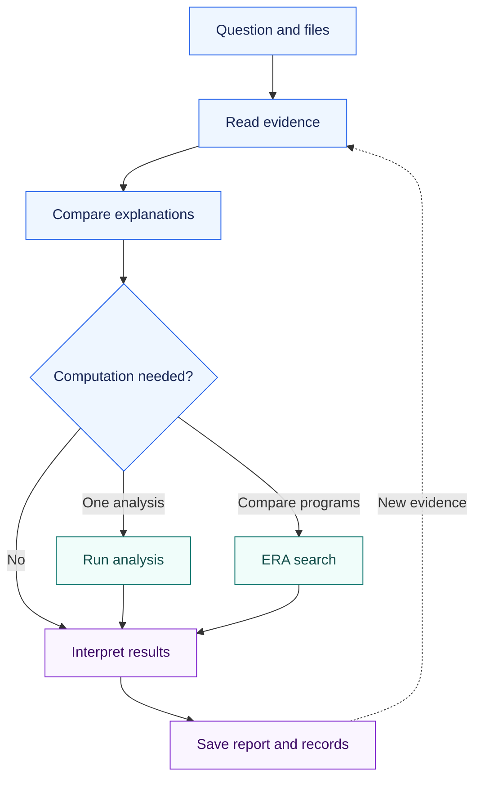
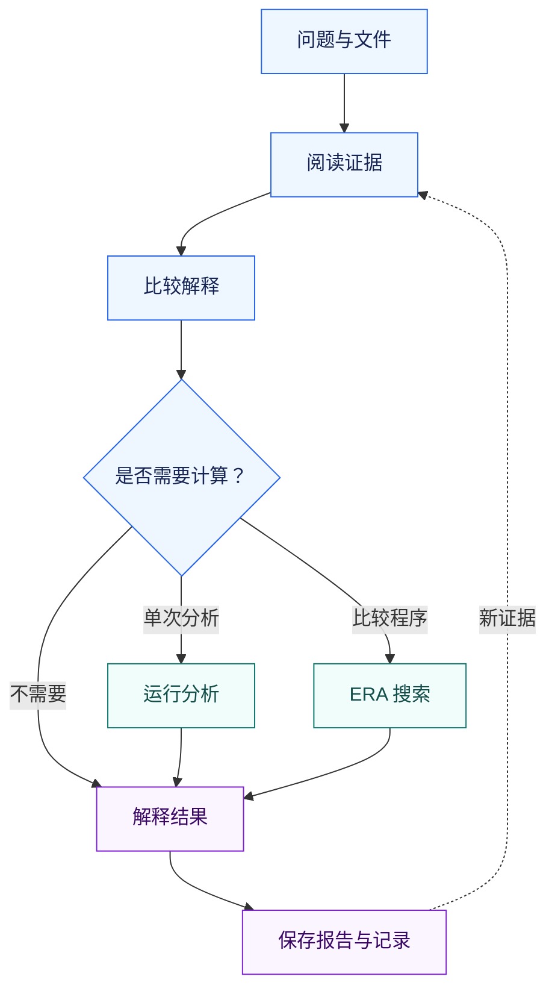

<div align="center">

# ResearchWeave

**An agentic AI system for scientific research**

[](VERSION)
[](#setup)
[](LICENSE)

[Install](#install) · [Research examples](#use-cases) · [Workflow](#workflow) · [Setup](#setup) · [References](#references)

[安装](#通过你的-ai-智能体安装) · [科研示例](#use-cases) · [运行流程](#一个科研任务如何运行) · [手动配置](#快速开始) · [参考文献](#参考文献)

</div>

ResearchWeave adds research instructions and local Python tools to **Codex**, **Claude Code**, and other agents that read files and run commands. It records evidence, hypotheses, analysis plans, code, and results in a study folder. The agent can read that folder when work resumes in another session.

The agent provides the language model and retrieval tools. ResearchWeave provides record management, research methods adapted from published systems, and an optional Docker runner for comparing Python programs.

**科研智能体系统**

ResearchWeave 为 **Codex**、**Claude Code** 等能够读取文件和执行命令的智能体提供科研指引和本地 Python 工具。证据、假设、分析计划、代码和结果保存在研究文件夹中，智能体可以在新会话里读取这些记录，继续工作。

语言模型和检索工具由你使用的智能体提供。ResearchWeave 提供研究记录管理、参考已发表系统编写的科研方法，以及用于比较 Python 程序的可选 Docker 运行工具。

---

<a id="install"></a>

## Install with your AI agent

Send this to your agent:

> Install and configure ResearchWeave from https://github.com/SUAT-ZhangLab/ResearchWeave. Read INSTALL.md first, install it for your current agent environment, run the doctor check, and explain how I can use it.

**For agents:** follow [INSTALL.md](INSTALL.md) when the user asks to install. Read `install.py` before running it and use the host application's permissions. Opening the URL alone does not authorize installation.

[Installation guide](INSTALL.md) · [Skill instructions](SKILL.md) · [Roles](references/roles.md) · [Commands](references/operations.md) · [Source material](agent-prompts/README.md)

## 通过你的 AI 智能体安装

把下面这段话发送给智能体：

> 请从 https://github.com/SUAT-ZhangLab/ResearchWeave 安装并配置 ResearchWeave。先阅读 INSTALL.md，根据你当前的智能体环境进行安装，运行 doctor 检查，并说明我该如何使用它。

**给智能体的说明：** 用户要求安装时，按照 [INSTALL.md](INSTALL.md) 操作。先阅读 `install.py`，再按所在应用的权限执行。仅打开网址不代表用户要求安装。

[安装指南](INSTALL.md) · [技能指引](SKILL.md) · [角色说明](references/roles.md) · [命令参考](references/operations.md) · [原始资料](agent-prompts/README.md)

---

<a id="use-cases"></a>

## What can I use ResearchWeave for?

The six examples below include a research question, input files, a prompt, and an expected output. They are hypothetical projects; their sample counts and observations are illustrative. The citations describe the relevant experiments or analysis methods. Literature retrieval uses your agent's tools. Specialized analyses require a configured analysis environment.

## ResearchWeave 可以用来做什么？

下面六类示例分别给出研究问题、输入文件、提问和预期输出。项目、样本数量和观察结果均为假设示例，引用文献用于说明相关实验或分析方法。文献检索使用智能体已有工具，专业分析需要预先配置相应环境。

<details open>
<summary><strong>01 · Literature review / 文献综述 — T-cell mRNA delivery</strong></summary>

### 1. Literature review and evidence synthesis

Compare published protocols against your cell model, measurements, and available equipment.

**Example: Choosing an mRNA delivery approach for primary T cells.**

**Project:** A team wants to compare lipid nanoparticle formulations for delivering reporter mRNA to primary human T cells. Before starting, it needs to decide which published approaches are relevant to resting cells and which depend on prior activation.

**Files:** A folder of candidate papers and supplementary methods, plus `project_requirements.md` describing the intended cell state, reporter, available instruments, and practical constraints.

> Use ResearchWeave to review these papers for mRNA delivery into primary human T cells. Make a table of cell source, activation state, delivery formulation, reporter expression, viability, observation time, and biological replicates. Separate particle uptake from functional protein expression. Identify which approaches best match our resting-cell project, explain the remaining uncertainties, and draft a first comparison with suitable controls and decision criteria. Link each reported value to its source.

**Output:** A comparison table with source links, selected formulations with reasons for inclusion, and an experiment plan with selection criteria.

**Reference:** Billingsley and colleagues report LNP-mediated CAR mRNA delivery to primary human T cells and measures protein expression and cell function ([Billingsley et al., 2020](https://doi.org/10.1021/acs.nanolett.9b04246)). Its experimental conditions should be compared with the resting-cell goal in this example.

---

### 1. 文献综述与证据整理

按细胞模型、测量指标和可用设备，比较文献方案是否适合自己的项目。

**示例：为原代 T 细胞选择 mRNA 递送方案。**

**研究项目：** 一个团队希望比较不同脂质纳米颗粒配方向人原代 T 细胞递送报告基因 mRNA 的效果。在开始实验前，需要判断哪些已发表方案适用于静息细胞，哪些依赖于预先激活。

**提供材料：** 候选论文及其补充方法，以及一份 `project_requirements.md`，说明目标细胞状态、报告基因、可用仪器和实际限制。

> 使用 ResearchWeave 阅读这些向人原代 T 细胞递送 mRNA 的论文。用表格整理细胞来源、激活状态、递送配方、报告蛋白表达、细胞存活率、观察时间和生物学重复。区分颗粒摄取与功能性蛋白表达。找出最符合我们静息细胞项目的方案，说明尚未解决的问题，并拟定第一次比较实验，包含适当的对照和方案选择标准。为每个文献数值标明来源。

**输出：** 带来源链接的比较表、候选配方及选择理由，以及写明配方选择标准的实验计划。

**参考：** Billingsley 等研究了通过脂质纳米颗粒向人原代 T 细胞递送 CAR mRNA，并测量蛋白表达和细胞功能（[Billingsley 等，2020](https://doi.org/10.1021/acs.nanolett.9b04246)）。使用时需要比较其具体实验条件与本示例的静息细胞目标是否一致。

</details>

<details>
<summary><strong>02 · Data analysis / 数据分析 — Paired tumor single-cell samples</strong></summary>

### 2. Research data analysis and interpretation

Analyze treatment differences using the study's sample pairing, biological replicates, and batch information.

**Example: Testing whether a T-cell state is associated with treatment response.**

**Project:** A hypothetical tumor single-cell study contains biopsies collected before and after treatment from 10 patients. The question is whether responders show a change in a cytotoxic T-cell expression program, a change in T-cell abundance, or both.

**Files:** `tumor_immune.h5ad`, `sample_metadata.csv` containing patient, time point, response, and batch, the quality-control notes, and the proposed gene set.

> Use ResearchWeave to compare pretreatment and post-treatment T cells in this dataset. First check patient pairing, cell annotations, and batch structure. Analyze changes in cell abundance separately from changes in gene expression, using patients as the independent biological units. Assess the response-associated change with a suitable paired analysis, examine whether one patient drives the result, and distinguish association from a causal treatment mechanism. Run the analysis in the configured single-cell environment and save the code, figures, and report.

**Output:** Sample checks, patient-level comparisons, plotting code, figures, and a report explaining the observed changes.

**Reference:** Single-cell differential-expression comparisons need to account for variation between biological replicates; treating individual cells as independent replicates can produce false discoveries ([Squair et al., 2021](https://doi.org/10.1038/s41467-021-25960-2)).

---

### 2. 科研数据分析与结果解释

根据样本配对、生物学重复和批次信息，分析处理前后的差异。

**示例：检验某种 T 细胞状态是否与治疗反应有关。**

**研究项目：** 一个假设的肿瘤单细胞项目包含 10 位患者治疗前后的配对活检样本。研究问题是：有治疗反应的患者是否出现了细胞毒性 T 细胞相关基因表达模式的变化、T 细胞数量占比的变化，或两者兼有。

**提供材料：** `tumor_immune.h5ad`、包含患者、时间点、治疗反应和批次信息的 `sample_metadata.csv`、质量检查记录，以及拟研究的基因集。

> 使用 ResearchWeave 比较这个数据集中治疗前后的 T 细胞。先检查患者配对、细胞注释和批次分布。将细胞数量占比变化与基因表达变化分开分析，并以患者作为独立生物学样本。采用合适的配对分析评估与治疗反应相关的变化，检查结果是否主要由某一位患者造成，并区分统计关联与治疗机制的因果解释。在已配置的单细胞分析环境中执行分析，保存代码、图和报告。

**输出：** 样本检查记录、患者层面的比较、绘图代码、图，以及对观察到的变化的解释。

**参考：** 单细胞差异表达比较需要考虑生物学重复之间的差异；将单个细胞当作独立重复，可能产生假阳性发现（[Squair 等，2021](https://doi.org/10.1038/s41467-021-25960-2)）。

</details>

<details>
<summary><strong>03 · Troubleshooting / 实验排查 — p-ERK and cell viability</strong></summary>

### 3. Hypothesis development and experimental troubleshooting

Check conflicting assay results and design an experiment that distinguishes their possible causes.

**Example: Investigating why pathway inhibition does not reduce cell growth.**

**Project:** In an illustrative lung cancer cell-line experiment, a candidate compound reduces phosphorylated ERK at an early time point, while the later viability assay changes little. The team needs to decide whether to investigate a transient effect, another growth-supporting pathway, or the assay itself.

**Files:** `western_blot_quantification.csv`, `viability_plate.csv`, the plate map, treatment and sampling notes, and relevant papers. Include the original images if the agent has suitable image-reading tools.

> Use ResearchWeave to investigate the mismatch between the early p-ERK result and later viability measurements. Check normalization, replicate structure, controls, and the timing of both assays. Compare explanations that fit the observations and state what each predicts. Recommend the smallest follow-up that would distinguish the leading explanations, explain how each possible outcome would change our interpretation, and do not treat a proposed mechanism as an established result.

**Output:** An assessment of both assays, competing explanations with predictions, and a follow-up experiment with an interpretation for each possible outcome.

**Reference:** Endpoint drug-response measurements can be influenced by cell division rate and assay duration, which makes assay design relevant when interpreting an apparent lack of response ([Hafner et al., 2016](https://doi.org/10.1038/nmeth.3853)).

---

### 3. 研究假设形成与实验问题排查

检查相互矛盾的检测结果，并设计能够区分原因的后续实验。

**示例：研究为什么通路受到抑制，细胞生长却没有明显下降。**

**研究项目：** 在一个示例性的肺癌细胞系实验中，候选化合物降低了早期时间点的 ERK 磷酸化水平，但较晚进行的细胞活力检测变化不大。团队需要判断，应优先研究抑制作用是否短暂、是否存在其他支持生长的通路，还是检测方法本身的问题。

**提供材料：** `western_blot_quantification.csv`、`viability_plate.csv`、孔板布局、处理与采样记录，以及相关论文。如果智能体具备适合的图像读取工具，还可以提供原始图像。

> 使用 ResearchWeave 分析早期 p-ERK 结果与后期细胞活力测量不一致的原因。检查归一化方法、重复设置、对照以及两种检测的时间安排。比较符合现有观察的解释，并说明每种解释会预测什么结果。建议能够区分主要解释的最小后续实验，说明每种可能结果会如何改变我们的判断，不要把提出的机制当作已经证实的结果。

**输出：** 对两种检测的评估、各个解释的预测，以及说明不同结果应如何解读的后续实验方案。

**参考：** 终点药物反应测量会受到细胞分裂速度和检测时长的影响，因此在解释“没有明显反应”时，需要考虑实验设计（[Hafner 等，2016](https://doi.org/10.1038/nmeth.3853)）。

</details>

<details>
<summary><strong>04 · Candidate selection / 候选筛选 — CRISPR screen hits</strong></summary>

### 4. Candidate prioritization and experiment design

Rank candidate targets using screen results and literature, then plan the first follow-up experiment.

**Example: Deciding which CRISPR-screen hit deserves follow-up.**

**Project:** A cell-based CRISPR screen has nominated three genes that may affect sensitivity to an anticancer compound. The team can investigate one gene first and wants to separate a drug-specific effect from a general reduction in cell fitness.

**Files:** `guide_counts.tsv`, sample metadata for baseline, vehicle, and drug-treated cultures, a gene-level results table, and notes on screen quality and available cell models.

> Use ResearchWeave to compare these three candidate genes. Review guide consistency, replicate agreement, baseline depletion, and the evidence for a drug-specific effect. Combine the screen results with relevant primary literature. Rank the candidates using explicit criteria, explain what could change the ranking, and design a follow-up using independent perturbations and an appropriate rescue or orthogonal test. Identify any additional data needed before selecting the lead.

**Output:** An evidence table for the candidates, a ranking or a list of data needed to rank them, and experiments to distinguish drug sensitivity from general fitness effects.

**Reference:** The drugZ study describes treated-versus-control CRISPR-screen analysis for identifying genetic changes that enhance or suppress drug activity ([Colic et al., 2019](https://doi.org/10.1186/s13073-019-0665-3)).

---

### 4. 候选对象排序与实验设计

根据筛选结果和文献确定候选靶点的优先顺序，安排第一轮后续实验。

**示例：决定哪个 CRISPR 筛选候选基因最值得跟进。**

**研究项目：** 一项细胞 CRISPR 筛选发现了三个可能影响抗癌化合物敏感性的基因。团队只能先研究一个，希望区分药物特异性作用与细胞生存或增殖能力普遍下降造成的影响。

**提供材料：** `guide_counts.tsv`、基线组、溶剂对照组和药物处理组的样本信息、基因层面的结果表，以及筛选质量和可用细胞模型的说明。

> 使用 ResearchWeave 比较这三个候选基因。检查不同向导 RNA 的结果是否一致、重复间是否一致、基线条件下是否已出现耗竭，以及是否有支持药物特异性作用的证据。结合筛选结果和相关原始研究文献，按明确标准排序，说明什么新信息可能改变排序，并设计包含独立干预和适当救援实验或另一种独立验证方法的后续研究。指出选定首选基因前还需要哪些数据。

**输出：** 候选基因的证据表、排序或完成排序所需的数据清单，以及区分药物敏感性变化与一般性生存、增殖影响的实验。

**参考：** drugZ 研究介绍了如何比较 CRISPR 筛选中的药物处理组和对照组，识别增强或减弱药物作用的遗传变化（[Colic 等，2019](https://doi.org/10.1186/s13073-019-0665-3)）。

</details>

<details>
<summary><strong>05 · Program improvement / 程序改进 — Enzyme activity prediction</strong></summary>

### 5. Analysis code and predictive model improvement

Run candidate programs on the same evaluation task and compare their scores and failures.

**Example: Improving a small model of enzyme activity with ERA.**

**Project:** A protein-engineering team has measurements for a small enzyme-variant panel and wants to compare simple models that predict residual activity after a heat challenge. Variants measured in the same experimental batch must stay together when evaluating predictions.

**Files:** A compact JSON dataset containing variant descriptors, measured activity, and batch IDs; a baseline Python prediction function; and an evaluation specification with development splits and a separate final test batch.

> Use ResearchWeave's ERA workflow to improve this prediction function. Preserve the supplied batch-aware development splits, fit preprocessing only on the training portion, and compare candidates with RMSE. Evaluate the baseline first and try at most eight candidate programs. Keep the final test batch out of development, then evaluate the selected candidate once. Record execution failures as well as scores, and explain whether any improvement is large enough to be useful for choosing variants to measure next.

**Output:** Executed candidate programs, a comparison against the baseline, saved search history, and a final test result. This example requires the Docker runner and a compact function-evaluation task; the baseline and specification must implement the intended batch-aware evaluation.

**Reference:** Separating development from final evaluation helps avoid data leakage and overly optimistic performance estimates ([Kapoor and Narayanan, 2023](https://doi.org/10.1016/j.patter.2023.100804)). The program-search method is informed by ERA ([Aygün et al., 2026](https://doi.org/10.1038/s41586-026-10658-6)).

---

### 5. 分析代码与预测模型改进

在同一评估任务上运行不同程序，比较得分并记录失败。

**示例：使用 ERA 改进一个小型酶活性预测模型。**

**研究项目：** 一个蛋白质工程团队已有一小组酶变体的测量数据，希望比较能够预测热处理后残余活性的简单模型。评估预测效果时，同一实验批次测量的变体需要分在同一组，不能跨训练集和评估集拆分。

**提供材料：** 一个包含变体描述特征、实测活性和批次编号的小型 JSON 数据集；一个基线 Python 预测函数；以及说明开发阶段数据划分和独立最终测试批次的评估要求。

> 使用 ResearchWeave 的 ERA 流程改进这个预测函数。保留给定的按批次划分方式，仅在训练部分拟合数据预处理步骤，并用均方根误差（RMSE）比较候选程序。先评估基线，最多尝试八个候选程序。开发过程中不使用最终测试批次，选定程序后只对该批次评估一次。记录执行失败和得分，并说明改进是否足以帮助选择下一批值得测量的变体。

**输出：** 实际运行过的候选程序、与基线的比较、保存的搜索历史和最终测试结果。本示例需要 Docker 运行工具，且任务应适合小型函数评估；基线程序和评估要求必须实现预定的按批次划分方式。

**参考：** 将开发过程与最终评估分开，有助于避免数据泄漏和过于乐观的性能估计（[Kapoor 与 Narayanan，2023](https://doi.org/10.1016/j.patter.2023.100804)）。程序搜索方法参考了 ERA（[Aygün 等，2026](https://doi.org/10.1038/s41586-026-10658-6)）。

</details>

<details>
<summary><strong>06 · Project handover / 项目交接 — New time-course results</strong></summary>

### 6. Research updates and project handover

Add new results to an existing study and prepare the records for another researcher or agent.

**Example: Updating a project when follow-up experiments change the explanation.**

**Project:** The lung cancer project in Example 3 has completed its follow-up. New measurements suggest that pathway inhibition is not sustained. Another researcher now needs to continue the project without reconstructing earlier decisions from chat messages.

**Files:** The saved study folder, its latest `ResearchReport.md`, a new time-course table, and the follow-up experiment notes.

> Continue this ResearchWeave project using its saved records. Add the new time-course results and compare them with our earlier predictions. Explain which hypotheses gain or lose support and whether the current data justify another experiment. Update the report without replacing the earlier records. Prepare a handover that lists the files analyzed, conclusions supported so far, unresolved questions, and the next decision the team needs to make.

**Output:** An updated report, links between new results and earlier analyses, and a handover listing files, conclusions, unresolved questions, and the next decision.

---

### 6. 研究更新与项目交接

把新结果加入已有研究，并整理供接手者使用的记录。

**示例：后续实验改变了原有解释，如何更新项目。**

**研究项目：** 示例 3 中的肺癌项目完成了后续实验，新测量提示通路抑制未能持续。另一位研究者需要接手项目，而不必从聊天记录中重新梳理此前的判断。

**提供材料：** 已保存的研究文件夹、最新的 `ResearchReport.md`、新的时间序列数据表，以及后续实验记录。

> 根据保存的记录继续这个 ResearchWeave 项目。加入新的时间序列结果，并与此前的预测比较。说明哪些假设获得了更多支持、哪些支持减少，以及现有数据是否足以支持开展另一个实验。保留早期记录并更新报告。整理一份交接说明，列出分析过的文件、目前有证据支持的结论、尚未解决的问题，以及团队下一步需要做出的决定。

**输出：** 更新后的报告、新结果与此前分析的关联，以及列出文件、结论、待解决问题和下一项决定的交接说明。

</details>

---

<a id="origins"></a>

## Why this project exists

ResearchWeave began by collecting the public methods, prompts, and code from **Robin** ([Ghareeb et al., 2026](https://doi.org/10.1038/s41586-026-10652-y)), **Co-Scientist** ([Gottweis et al., 2026](https://doi.org/10.1038/s41586-026-10644-y)), and **ERA** ([Aygün et al., 2026](https://doi.org/10.1038/s41586-026-10658-6)). Selected responsibilities were adapted into instructions for literature review, hypothesis comparison, analysis, and reporting.

The project then added Python tools to save research records, copy input files, run programs, and install the skill. This gives the agent a study folder it can inspect and update across sessions. One agent can follow the roles in sequence; separate agents can handle independent tasks when supported by the host application.

## 为什么开发这个项目

ResearchWeave 最初整理了 **Robin**（[Ghareeb 等，2026](https://doi.org/10.1038/s41586-026-10652-y)）、**Co-Scientist**（[Gottweis 等，2026](https://doi.org/10.1038/s41586-026-10644-y)）和 **ERA**（[Aygün 等，2026](https://doi.org/10.1038/s41586-026-10658-6)）公开的方法、提示词和代码，再将部分职责改写成文献阅读、假设比较、数据分析和报告撰写指引。

随后，项目增加了保存研究记录、复制输入文件、运行程序和安装技能的 Python 工具。智能体可以在不同会话中读取和更新同一研究文件夹。一个智能体可以依次承担这些职责；所在应用支持时，也可以由不同智能体处理独立任务。

## Where the methods come from

| Source | What informed ResearchWeave | What is included here |
| --- | --- | --- |
| [Robin — FutureHouse](https://github.com/Future-House/robin) · [Ghareeb et al., 2026](https://doi.org/10.1038/s41586-026-10652-y) | Organizing literature research, experimental ideas, candidate comparisons, data interpretation, and follow-up work | Attributed public prompts, selected source files, and adapted role guidance |
| Co-Scientist · [Gottweis et al., 2026, and supplementary information](https://doi.org/10.1038/s41586-026-10644-y) | Generating hypotheses, reflecting on observations, comparing explanations, improving proposals, and synthesizing reviews | Public supplementary material, extracted templates, and adapted research methods |
| [ERA — Google Research](https://github.com/google-research/era) · [Aygün et al., 2026](https://doi.org/10.1038/s41586-026-10658-6) | Improving candidate programs through execution feedback and search | The upstream FUTS search implementation, public prompt/task extracts, and a project-written stepwise interface |
| [Finch — FutureHouse contributors, source snapshot](https://github.com/Future-House/finch/tree/aea66fdf2dd2be827727de50a73cae60dff59972) | Additional data-analysis prompts | An attributed supplementary prompt collection |

ResearchWeave adds the **skill instructions, record format, input-file copies, command-line tools, Docker runner, installer, and tests**. Versions are recorded in [config/sources.json](config/sources.json); licenses and attribution are listed in [THIRD_PARTY_NOTICES.md](THIRD_PARTY_NOTICES.md).

Robin and Co-Scientist supply research methods and prompt material. ERA supplies the FUTS code used in program-search sessions. Google's hosted Co-Scientist and the original Robin and ERA cloud services are not connected by this installation.

Original English prompts are stored separately from adapted instructions. Several role guides are in Chinese; this README is bilingual and [INSTALL.md](INSTALL.md) is in English. The agent responds in the language you request.

## 研究方法来自哪里

| 来源 | ResearchWeave 参考的内容 | 本项目收录的材料 |
|---|---|---|
| Robin：FutureHouse | 组织文献研究、实验构想、候选比较、数据解释和后续研究 | 注明来源的公开提示词、部分源代码及改写的角色指引 |
| Co-Scientist：论文与补充材料 | 生成假设、反思观察、比较解释、改进方案和综合评议 | 公开补充材料、提取的模板及改写的研究方法 |
| ERA：Google Research | 根据执行反馈和搜索改进候选程序 | 原始 FUTS 搜索实现、公开提示词和任务摘录，以及本项目编写的分步接口 |
| Finch：FutureHouse 贡献者，指定版本源代码 | 补充的数据分析提示词 | 注明来源的补充提示词集 |

ResearchWeave 增加了**技能指引、记录格式、输入文件副本、命令行工具、Docker 运行工具、安装程序和测试**。来源版本见 [config/sources.json](config/sources.json)，许可证和署名见 [THIRD_PARTY_NOTICES.md](THIRD_PARTY_NOTICES.md)。

Robin 和 Co-Scientist 提供了研究方法和提示词材料；ERA 提供了程序搜索中使用的 FUTS 代码。安装本项目不会连接 Google 托管的 Co-Scientist 服务，或原始 Robin、ERA 的云服务。

英文原始提示词与改写指引分开保存。部分角色指南使用中文，本 README 提供中英文对照，[INSTALL.md](INSTALL.md) 使用英文。智能体按你要求的语言回答。

---

<a id="workflow"></a>

## How a research task runs

The agent reads the question and available files, plans a comparison, runs any required analysis, and writes the report. New evidence can lead it back to an earlier step. These steps run in the active agent session.



| Step | What the agent records |
|---|---|
| **1. Read** | The question, available files, and evidence sources. Literature observations, project measurements, synthetic examples, and inference have separate labels. |
| **2. Compare** | Candidate explanations, the observations supporting each, and the results each predicts. A focused literature question can be answered without proposing new hypotheses. |
| **3. Plan** | Input files, methods, comparison groups, independent sample units, evaluation criteria, and linked hypotheses. |
| **4. Execute** | The code, input-file copies with SHA256 digests, outputs, and any execution failures. A run is recorded as completed only after execution. |
| **5. Report** | The interpretation, unresolved explanations, and proposed next experiment, if needed. The agent adds scientific interpretation to the record summary produced by `research report`. |

For paired patient data, repeated measurements belong to the same patient. Single-cell comparisons also need to account for biological replicates ([Squair et al., 2021](https://doi.org/10.1038/s41467-021-25960-2)). A model's ranking of hypotheses is a judgment, not a measured biological effect or a probability of truth.

The Docker runner handles small Python functions. Large datasets, R, or GPU work require a separate analysis environment. Record the files and outcomes from that environment in the study. To resume, read the study status and `ResearchReport.md`.

## 一个科研任务如何运行

智能体读取问题和已有文件，确定比较方式，执行所需分析，再撰写报告。获得新证据后，可以回到前面的步骤重新判断。这些操作在当前智能体会话中执行。



| 步骤 | 智能体记录的内容 |
|---|---|
| **1. 阅读** | 研究问题、可用文件和证据来源。文献观察、项目实测数据、人工构造示例和推断分别标记。 |
| **2. 比较** | 候选解释、各自的支持证据和预测结果。具体的文献问题可以直接回答，无须额外提出新假设。 |
| **3. 计划** | 输入文件、方法、比较组、独立样本单位、评估标准，以及关联假设。 |
| **4. 执行** | 代码、带 SHA256 摘要的输入副本、输出和执行失败信息。程序运行后才记录为已完成。 |
| **5. 报告** | 结果解释、尚未排除的其他解释，以及需要时提出的下一项实验。`research report` 生成记录摘要，科学解释由智能体补充。 |

患者配对数据中的重复测量属于同一位患者。单细胞比较也需要考虑生物学重复（[Squair 等，2021](https://doi.org/10.1038/s41467-021-25960-2)）。模型对假设的排序属于判断，不是生物学效应的测量值，也不是机制成立的概率。

Docker 运行工具用于小型 Python 函数。大数据集、R 或 GPU 分析需要另行配置环境，再把文件和结果写入研究记录。继续已有项目时，先读取研究状态和 `ResearchReport.md`。

## The optional ERA program-improvement cycle

Use ERA when you have a Python function to improve, development data, and an evaluation metric. The method follows [Aygün et al. (2026)](https://doi.org/10.1038/s41586-026-10658-6). Candidate selection uses the [upstream Flat UCB Tree Search (FUTS) implementation](https://github.com/google-research/era/blob/b836730b5c000526af95116b1d0e2c60c8cf0a10/implementation/futs.py).

| Command | Action |
|---|---|
| `init` | Save the problem, data, and baseline program; evaluate the baseline. |
| `ask` | Choose a parent candidate with FUTS and return a request. The agent reads the feedback and writes a candidate program. |
| `tell` | Execute the candidate, score its output, and save the result or failure. Repeat `ask` / `tell` up to the chosen iteration limit. |
| `finalize` | Select the best development candidate and evaluate the supplied final data once. |

The agent writes the programs; the controller runs them without calling another model API. It supports `rmse` and `accuracy`, saves candidate history and request IDs, checks for changed inputs, and rejects stale submissions.

Set aside final evaluation data before development and keep it out of candidate prompts. The agent can still access local files, so this separation depends on how the study is run. Program scores measure performance on the evaluation task; biological claims need experimental evidence.

## 可选的 ERA 程序改进流程

已有待改进的 Python 函数、开发数据和评估指标时，可以使用 ERA。方法参考 [Aygün 等（2026）](https://doi.org/10.1038/s41586-026-10658-6)，候选选择使用[原始 Flat UCB Tree Search（FUTS）实现](https://github.com/google-research/era/blob/b836730b5c000526af95116b1d0e2c60c8cf0a10/implementation/futs.py)。

| 命令 | 操作 |
|---|---|
| `init` | 保存问题、数据和基线程序，并评估基线。 |
| `ask` | 用 FUTS 选择作为改进起点的程序，返回请求。智能体阅读反馈，编写候选程序。 |
| `tell` | 执行候选程序、评分并保存结果或失败信息。按设定的次数重复 `ask` / `tell`。 |
| `finalize` | 选择开发阶段表现最佳的候选程序，对提供的最终数据评估一次。 |

智能体编写程序，控制工具负责执行，不调用其他模型 API。支持 `rmse`（均方根误差）和 `accuracy`（准确率），保存候选历史和请求编号，检查输入变化，并拒绝对应旧请求的提交。

在开发前留出最终评估数据，不将其放入改进候选程序的提示词。智能体仍能访问本地文件，因此需要在实际操作中遵守这项要求。程序得分表示评估任务上的表现，生物学结论需要实验支持。

---

<a id="setup"></a>

## Quick start

### Requirements

| Capability | What is needed |
| --- | --- |
| Read the methods and prompts | An agent that can read the repository |
| Install the skill and keep research records | Python 3.10+; Python 3.12 is recommended |
| Literature retrieval and model reasoning | The host agent's own tools and account |
| Execute candidate programs | Docker with Linux containers and the project runner image |
| Large datasets, R, GPU, or file-heavy analyses | An environment selected for that task |

The core installer, research records, and search controller use the Python standard library. Docker image construction downloads its scientific Python dependencies. ResearchWeave does not require separate OpenAI, Edison, or Gemini API keys; your agent's own service requirements still apply.

### Install manually

```sh
git clone https://github.com/SUAT-ZhangLab/ResearchWeave.git
cd ResearchWeave
python install.py --agent codex
```

For Claude Code:

```sh
python install.py --agent claude
```

For another agent that reads `SKILL.md`:

```sh
python install.py --agent generic --destination "/your/agent/skills/researchweave"
```

Use `python3` instead of `python` if that is your system's command. If Git is unavailable, download the repository using **Code → Download ZIP**, extract it, and run the same installation command from the extracted directory.

The installer checks file hashes, copies the skill, and runs `doctor`. It leaves an identical installation unchanged and preserves a destination containing different files. Installation uses the Python standard library and leaves PATH unchanged. The installed copy can run after the downloaded repository is removed.

Default skill locations and support for older Codex installations are documented in [INSTALL.md](INSTALL.md). After installation, reload skills or start a new session. Use **`$researchweave` in Codex** or **`/researchweave` in Claude Code**.

### Start a research task

For example, tell your agent:

> Use ResearchWeave to read these papers and measurements. Compare the two proposed explanations, run the analyses needed to distinguish them, and save the code, results, and interpretation in the study folder.

From the repository root, the basic commands are:

```sh
python researchweave.py doctor
python researchweave.py research init --study "research/my-study" --question "What explains the observed difference?"
python researchweave.py research status --study "research/my-study"
```

When the skill is installed elsewhere, call `python /actual/skill/path/researchweave.py` and pass an explicit study path. Research files belong in the user's project, not in the skill installation directory.

See [the command reference](references/operations.md) for evidence records, input attachments, actual program execution, and ERA session examples. The files in `examples/` are templates or clearly labeled synthetic demonstrations, not research findings.

## 快速开始

### 使用要求

| 用途 | 所需条件 |
|---|---|
| 阅读方法和提示词 | 能够读取仓库文件的智能体 |
| 安装技能并保存研究记录 | Python 3.10 或更高版本；推荐 Python 3.12 |
| 检索文献与模型推理 | 当前智能体自带的工具和账号 |
| 执行候选程序 | 支持 Linux 容器的 Docker，以及本项目的运行镜像 |
| 大数据集、R、GPU 或大量文件分析 | 针对该任务配置的环境 |

核心安装程序、研究记录工具和搜索控制程序使用 Python 标准库。构建 Docker 镜像时会下载所需的科学计算 Python 依赖。ResearchWeave 不要求额外提供 OpenAI、Edison 或 Gemini API 密钥，但你所用智能体本身的服务要求仍然适用。

### 手动安装

```sh
git clone https://github.com/SUAT-ZhangLab/ResearchWeave.git
cd ResearchWeave
python install.py --agent codex
```

如果使用 Claude Code：

```sh
python install.py --agent claude
```

如果使用其他能够读取 `SKILL.md` 的智能体：

```sh
python install.py --agent generic --destination "/your/agent/skills/researchweave"
```

如果系统使用 `python3` 命令，请用它替代 `python`。如果没有安装 Git，可以通过 **Code → Download ZIP** 下载仓库，解压后在对应目录运行相同的安装命令。

安装程序检查文件摘要、复制技能并运行 `doctor`。已有安装相同时保持原样，目标目录包含不同文件时保留原目录。安装过程使用 Python 标准库，保持 PATH 不变。删除下载的仓库后，已安装的副本仍可使用。

默认技能目录及对旧版 Codex 安装方式的支持见 [INSTALL.md](INSTALL.md)。安装后重新加载技能或开启新会话。在 **Codex 中使用 `$researchweave`**，在 **Claude Code 中使用 `/researchweave`**。

### 开始一个科研任务

例如，可以这样告诉你的智能体：

> 使用 ResearchWeave 阅读这些论文和测量数据。比较提出的两种解释，执行区分它们所需的分析，把代码、结果和解释保存在研究文件夹中。

在仓库根目录运行以下基本命令：

```sh
python researchweave.py doctor
python researchweave.py research init --study "research/my-study" --question "What explains the observed difference?"
python researchweave.py research status --study "research/my-study"
```

如果技能安装在其他位置，请使用 `python /actual/skill/path/researchweave.py`，并明确指定研究目录。研究文件应保存在用户的项目目录中，而不是技能安装目录中。

证据记录、输入附件、实际程序执行和 ERA 会话示例见[命令参考](references/operations.md)。`examples/` 中的文件是模板，或已明确标注的人工构造演示，不是研究发现。

## Configure code execution when needed

Start Docker with Linux-container support, then run:

```sh
docker build -t researchweave-runner:0.1.0 -f config/era.Dockerfile config
python researchweave.py doctor --container
```

The first build needs network access. The ordinary `doctor` command only checks the required files; `doctor --container` also runs a small program through the container runner.

The runner uses a non-root container, disabled networking, a read-only root filesystem, and no host-directory mounts. It accepts JSON requests up to about **8 MiB**, returns about **1 MiB** of output, and defaults to a **60-second** execution limit. Use it for small function-evaluation tasks; run large-data or GPU analyses in a separate environment.

Windows can use Docker Desktop or Docker in WSL. The default mode prefers a `docker` command on PATH; without one, Windows uses WSL. Set `RESEARCHWEAVE_DOCKER_MODE` to `native` or `wsl` when needed, and `RESEARCHWEAVE_WSL_DISTRO` to the actual distribution name. Detailed commands are in [INSTALL.md](INSTALL.md).

## 需要执行代码时的配置

启动支持 Linux 容器的 Docker，然后运行：

```sh
docker build -t researchweave-runner:0.1.0 -f config/era.Dockerfile config
python researchweave.py doctor --container
```

首次构建需要联网。普通的 `doctor` 命令只检查必需文件；`doctor --container` 还会通过容器运行工具实际执行一个小程序。

运行工具使用非 root 用户的容器，禁用网络，将根文件系统设为只读，且不挂载电脑上的目录。它接受约 **8 MiB** 以内的 JSON 请求，返回约 **1 MiB** 以内的输出，默认执行时限为 **60 秒**。这适用于小型函数评估任务；大数据或 GPU 分析需使用其他环境。

Windows 可以使用 Docker Desktop 或 WSL 中的 Docker。默认优先使用 PATH 中的 `docker` 命令；如果找不到，则在 Windows 上使用 WSL。需要时可将 `RESEARCHWEAVE_DOCKER_MODE` 设为 `native` 或 `wsl`，并将 `RESEARCHWEAVE_WSL_DISTRO` 设为实际发行版名称。详细命令见 [INSTALL.md](INSTALL.md)。

---

<a id="records"></a>

## What is saved

Research records use these types:

| Type | Purpose |
| --- | --- |
| `evidence` | A source-supported observation and its evidence category |
| `hypothesis` | An explanation, predictions, and links to supporting records |
| `analysis` | Inputs, method, comparison, sample unit, and evaluation criteria |
| `code` | The actual program used |
| `result` | An observed outcome linked to its analysis and code |
| `review` | An assessment of explanations or findings, with supporting evidence |
| `update` | New findings, changed conclusions, and planned next steps |

Records are JSON files linked by record IDs. Input attachments are copied and hashed to identify the exact files used. File locks and atomic writes protect against conflicting updates. Revised conclusions are saved as new records, preserving earlier entries.

## 系统会保存什么

研究记录包含以下类型：

| 类型 | 用途 |
|---|---|
| `evidence`（证据） | 有来源支持的观察及其证据类别 |
| `hypothesis`（假设） | 解释、预测及相关支持记录的链接 |
| `analysis`（分析） | 输入、方法、比较对象、样本单位和评估标准 |
| `code`（代码） | 实际使用的程序 |
| `result`（结果） | 关联到具体分析和代码的实际结果 |
| `review`（评议） | 对解释或发现进行有依据的评估 |
| `update`（更新） | 新结果、结论变化和下一步计划 |

记录保存为 JSON 文件，通过记录编号关联。输入附件会被复制并计算摘要，用于确定当时使用的文件。文件锁和原子写入减少同时更新造成的冲突。修正后的结论保存为新记录，早期记录继续保留。

## Repository layout

```text
ResearchWeave/
  README.md                 Project background, workflow, and quick start
  INSTALL.md                Installation instructions for agents and people
  SKILL.md                  Research instructions loaded by the host agent
  AGENTS.md / CLAUDE.md      Repository entry points
  install.py                Self-contained skill installer
  researchweave.py           Command-line entry point
  references/               Roles, operations, and source attribution
  scripts/                  Records, ERA interface, Docker runner, and tests
  agent-prompts/             Attributed original prompts and extraction records
  vendor/                   Selected upstream source and licenses
  config/                   Source versions and Docker build definition
  examples/                 Input templates and synthetic examples
```

The repository contains the project itself. It excludes active research datasets, private results, credentials, installed Python environments, and Docker images. GitHub's source ZIP contains the same project files as the repository.

## 仓库结构

```text
ResearchWeave/
  README.md                 项目背景、流程与快速开始
  INSTALL.md                面向智能体和使用者的安装说明
  SKILL.md                  由当前智能体读取的科研指引
  AGENTS.md / CLAUDE.md      仓库入口说明
  install.py                可独立使用的技能安装程序
  researchweave.py           命令行入口
  references/               角色、操作与来源说明
  scripts/                  研究记录、ERA 接口、Docker 运行工具与测试
  agent-prompts/             注明来源的原始提示词与提取记录
  vendor/                   选用的原始项目源代码与许可证
  config/                   来源版本与 Docker 构建配置
  examples/                 输入模板与人工构造示例
```

仓库包含项目本身，不包含正在使用的研究数据集、私有结果、凭据、已安装的 Python 环境或 Docker 镜像。GitHub 的源码 ZIP 与仓库包含相同的项目文件。

---

<a id="development"></a>

## Verification and development

```sh
python install.py --check
python researchweave.py doctor
python agent-prompts/verify_extractions.py
python -m unittest discover -s scripts -p "test_*.py"
```

Core tests cover research-record relationships, copied input bytes, recorded execution failures, candidate-session state, score handling, installation, and preservation of existing files. Prompt checks compare extracted text and source hashes with the saved manifests.

To include the actual Docker ERA integration test, build the image and set `RESEARCHWEAVE_DOCKER_TESTS=1` before running the tests. Without that setting, the container test is explicitly skipped. The included GitHub Actions workflow runs the non-container suite on Windows, macOS, and Linux with Python 3.10 and 3.12.

The suite tests file handling, execution, scoring, and installation. Scientific performance would need a separate evaluation on research tasks.

## 检查与开发

```sh
python install.py --check
python researchweave.py doctor
python agent-prompts/verify_extractions.py
python -m unittest discover -s scripts -p "test_*.py"
```

核心测试覆盖研究记录之间的关联、输入副本的内容、执行失败记录、候选程序会话状态、评分处理、安装过程，以及对已有文件的保留。提示词检查将提取的文本和源文件摘要与保存的清单进行比较。

如需运行实际的 Docker ERA 集成测试，请先构建镜像，并在运行测试前设置 `RESEARCHWEAVE_DOCKER_TESTS=1`。未设置时，容器测试会明确跳过。项目包含的 GitHub Actions 工作流使用 Python 3.10 和 3.12，在 Windows、macOS 和 Linux 上运行不依赖容器的测试。

这些测试检查文件处理、程序执行、评分和安装。科研表现需要另用研究任务进行评估。

## Sources and licensing

Project-written integration code and documentation use [Apache-2.0](LICENSE), except where an adapted section explicitly retains another source license. Upstream source, extracted prompts, and paper material retain their original attribution and licenses, including CC BY 4.0 for the Co-Scientist material.

Read [THIRD_PARTY_NOTICES.md](THIRD_PARTY_NOTICES.md), [the source guide](references/sources.md), and the manifests under `agent-prompts/` for versions, extraction details, and the distinction between original text and adapted instructions.

## 来源与许可证

本项目编写的整合代码和文档使用 [Apache-2.0](LICENSE) 许可证，明确保留其他来源许可证的改写部分除外。原始项目代码、提取的提示词和论文材料保留原有署名与许可证，其中 Co-Scientist 材料使用 CC BY 4.0。

具体版本、材料提取方式，以及原文和改写指引的区别，见 [THIRD_PARTY_NOTICES.md](THIRD_PARTY_NOTICES.md)、[来源指南](references/sources.md)和 `agent-prompts/` 下的清单。

## References

### Research-agent methods and source code

- **Ghareeb, A. E., Chang, B., Mitchener, L., et al. (2026).** [A multi-agent system for automating scientific discovery](https://doi.org/10.1038/s41586-026-10652-y). *Nature*, **655**, 497–505. Robin source used here: [Future-House/robin, commit `4a5cce3`](https://github.com/Future-House/robin/tree/4a5cce310f3bc7663a67117db88af43b84733ffe).
- **Gottweis, J., Weng, W.-H., Daryin, A., et al. (2026).** [Accelerating scientific discovery with Co-Scientist](https://doi.org/10.1038/s41586-026-10644-y). *Nature*, **655**, 487–496. Includes the public supplementary methods and prompts; the [supplementary PDF](agent-prompts/co-scientist/source/41586_2026_10644_MOESM1_ESM.pdf) and [extraction record](agent-prompts/co-scientist/manifest.json) are included in this repository.
- **Aygün, E., Belyaeva, A., Comanici, G., et al. (2026).** [An AI system to help scientists write expert-level empirical software](https://doi.org/10.1038/s41586-026-10658-6). *Nature*, **654**, 909–916. ERA source used here: [google-research/era, commit `b836730`](https://github.com/google-research/era/tree/b836730b5c000526af95116b1d0e2c60c8cf0a10).
- **FutureHouse contributors.** [Finch: an aviary-based data science agent based on Jupyter notebooks](https://github.com/Future-House/finch/tree/aea66fdf2dd2be827727de50a73cae60dff59972). Software source, commit `aea66fd`; source snapshot retrieved 15 September 2026. See the [local prompt manifest](agent-prompts/robin-components/manifest.json) for the exact files and extracted text used here.

### Scientific and methodological background for the examples

- **Billingsley, M. M., Singh, N., Ravikumar, P., Zhang, R., June, C. H., and Mitchell, M. J. (2020).** [Ionizable Lipid Nanoparticle-Mediated mRNA Delivery for Human CAR T Cell Engineering](https://doi.org/10.1021/acs.nanolett.9b04246). *Nano Letters*, **20**(3), 1578–1589.
- **Squair, J. W., Gautier, M., Kathe, C., et al. (2021).** [Confronting false discoveries in single-cell differential expression](https://doi.org/10.1038/s41467-021-25960-2). *Nature Communications*, **12**, 5692.
- **Hafner, M., Niepel, M., Chung, M., and Sorger, P. K. (2016).** [Growth rate inhibition metrics correct for confounders in measuring sensitivity to cancer drugs](https://doi.org/10.1038/nmeth.3853). *Nature Methods*, **13**, 521–527.
- **Colic, M., Wang, G., Zimmermann, M., et al. (2019).** [Identifying chemogenetic interactions from CRISPR screens with drugZ](https://doi.org/10.1186/s13073-019-0665-3). *Genome Medicine*, **11**, 52.
- **Kapoor, S., and Narayanan, A. (2023).** [Leakage and the reproducibility crisis in machine-learning-based science](https://doi.org/10.1016/j.patter.2023.100804). *Patterns*, **4**(9), 100804.

## 参考文献

<details>
<summary>论文题名中文说明与来源</summary>

### 科研智能体方法与源代码

- **Ghareeb, A. E., Chang, B., Mitchener, L., et al. (2026).** 用于自动化科学发现的多智能体系统。本项目使用上述 Robin 指定提交版本的源代码。 [原文与来源](https://doi.org/10.1038/s41586-026-10652-y)

- **Gottweis, J., Weng, W.-H., Daryin, A., et al. (2026).** 借助 Co-Scientist 加速科学发现。本仓库收录了公开补充方法和提示词，并提供补充 PDF 与提取记录。 [原文与来源](https://doi.org/10.1038/s41586-026-10644-y)

- **Aygün, E., Belyaeva, A., Comanici, G., et al. (2026).** 帮助科学家编写专家水平实证研究软件的 AI 系统。本项目使用上述 ERA 指定提交版本的源代码。 [原文与来源](https://doi.org/10.1038/s41586-026-10658-6)

- **FutureHouse contributors.** Finch 是基于 aviary 和 Jupyter notebooks 的数据科学智能体。源代码版本为 `aea66fd`，于 2026 年 9 月 15 日获取；实际使用的文件和提取文本见上述本地提示词清单。 [原文与来源](https://github.com/Future-House/finch/tree/aea66fdf2dd2be827727de50a73cae60dff59972)

### 科研示例的科学与方法学背景

- **Billingsley, M. M., Singh, N., Ravikumar, P., Zhang, R., June, C. H., and Mitchell, M. J. (2020).** 通过可离子化脂质纳米颗粒递送 mRNA，用于人 CAR T 细胞工程。 [原文与来源](https://doi.org/10.1021/acs.nanolett.9b04246)

- **Squair, J. W., Gautier, M., Kathe, C., et al. (2021).** 应对单细胞差异表达分析中的假阳性发现。 [原文与来源](https://doi.org/10.1038/s41467-021-25960-2)

- **Hafner, M., Niepel, M., Chung, M., and Sorger, P. K. (2016).** 用生长速率抑制指标修正癌症药物敏感性测量中的混杂因素。 [原文与来源](https://doi.org/10.1038/nmeth.3853)

- **Colic, M., Wang, G., Zimmermann, M., et al. (2019).** 使用 drugZ 从 CRISPR 筛选中识别化合物与基因之间的相互作用。 [原文与来源](https://doi.org/10.1186/s13073-019-0665-3)

- **Kapoor, S., and Narayanan, A. (2023).** 基于机器学习的科学研究中的数据泄漏与可重复性危机。 [原文与来源](https://doi.org/10.1016/j.patter.2023.100804)

</details>

## Authors

ResearchWeave is developed and maintained by **Zhang Lab, [Shenzhen University of Advanced Technology (SUAT)](https://www.suat-sz.edu.cn/en/index.htm), Shenzhen, China**.

## 作者

ResearchWeave 由**中国深圳的[深圳理工大学（SUAT）](https://www.suat-sz.edu.cn/en/index.htm) Zhang Lab** 开发和维护。
